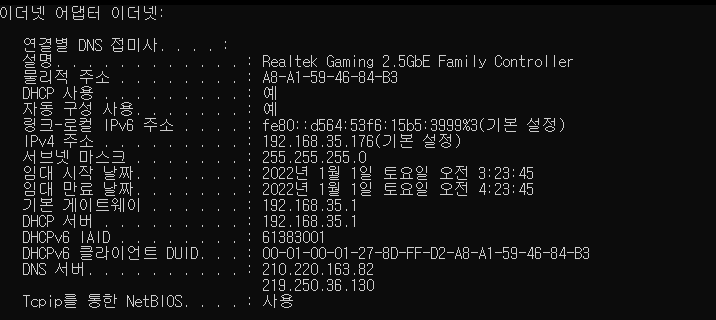

# DNS

## DHCP 서비스와 DNS 서비스 그리고 물리적 주소의 의미

- DHCP 사용 : PC에서 IP 주소를 유동 IP 방식으로 사용
    - IP 주소는 원래 사용자가 IP 주소와 서브넷 마스크, 기본 게이트웨이 등을 직접 입력해야 하지만 쉽지 않다. DHCP 서비스는 사용할 IP 주소 범위를 서버에 미리 등록하면 PC 사용자에게 IP 주소와 서브넷 마스크, 게이트웨이 IP 주소, DNS 서버 IP 주소를 자동으로 할당해준다.
    - 가정에서 인터넷을 사용하는 초고속 인터넷 가입자는 DHCP 서비스 방식을 이용한다.

- ‘임대 시작 날짜’와 ‘임대 만료 날짜’가 있는데 DHCP 방식에 따라 IP 주소를 할당받은 시간과 IP 주소를 사용한 시간이고 동시에 PC 사용 시간을 의미한다.

- ‘기본 게이트웨이’와 ‘DHCP 서버’의 IP 주소가 같은데 게이트웨이에서 DHCP 기능을 수행한다는 것이다. 다시 말해, 무선 공유기는 게이트웨이 역할과 DHCP 서버 기능도 수행한다.

- DNS 서버 : 두 IP 주소가 보이는데 IPS에서 제공하는 DNS 서버 IP 주소다.
    - DNS 서버는 사용자가 입력한 도메인 네임을 IP 주소로 변환한다.
    - 도메인 네임과 IP 주소의 대응관계를 일종의 DB 형태로 저장해 사용하는 기능이 DNS 서비스

- 물리적 주소: 맥(MAC) 주소라고도 하며 이더넷 어댑터 로컬 영역 연결 부분과 관련이 있다.
    - 맥 주소는 LAN 영역에서 내부 통신을 수행하기 위해 필요한 주소이다.
    - 출발지에서 스위치 장비를 통해 목적지로 이동하고, 이 때 스위치 장비의 내장 테이블에 맥 주소를 저장 및 검색하는데 이 과정을 스위칭이라고 한다.
    - 스위치는 맥 주소 인식을 통해 목적지 맥 주소가 있는 해당 포트로만 데이터를 전송하는데, 이를 포워딩이라고 한다.
---
## 이름확인

### 호스트파일 이름확인
- 예전에는 호스트이름을 IP주소와 연관시킨 테이블을 가진 호스트 파일로 이름을 확인했었지만, 대규모 네트워크에서는 비효율적이다. -> DNS의 개발로 이어짐
- 호스트 파일은 앞쪽에 IP주소, 뒤쪽에 호스트 이름과 별도 설명이 있다
- 호스트 파일은 위에서 아래로 읽어지기 때문에 자주 쓰이는 목록을 위에 두어야 효율적이다
- 호스트 파일은 정적이며, IP주소가 바뀌면 수동으로 수정해야 한다
- 간단하며 소규모 네트워크에서 효율적

### DNS 이름확인
- 호스트 파일을 계속 수정하는 작업을 피하기 위해 DNS 서버를 사용
- DNS 서버를 사용하면 네트워크 변화가 일어날때 DNS 서버의 DNS 구성만 변경하면 됨
- 검색 속도를 최적화 할 수 있고, 더 큰 데이터 제공 가능

### DNS 서버 분할
- 하나의 DNS서버에서 모든 처리를 하는것은 비효율적
- 로컬 DNS 서버가 작동하고, 모든 DNS 서버끼리 서로 통신하도록 한다
- DNS 서버가 자신의 데이터베이스에서 주소를 찾지 못한다면 다른 이름에 주소를 찾도록 해당 주소를 클라이언트에게 보낸다

### DNS 이름 스페이스

#### FQDN
- FQDN은 전체 주소 도메인 이름으로 호스트 이름을 함께 포함한다.(호스트 이름과 도메인 명시)
- DNS는 FQDN과 작동한다.

#### DNS 이름
- DNS 이름 스페이스는 도메인의 다중 계층 배열
- DNS 트리 상단에는 단일 노드인 루트. 보통 마침표(.)로 나타냄
- 루트 밑에는 TLD(최상위 도메인)
    - .com, .org, .edu
- TLD 밑에는 회사, 조직 등등 에서 운영하는 도메인 계층
- 도메인에 권한이 있는 기관은 하나 이상의 하위 도메인 생성 가능
- 로컬 도메인의 이름은 부모 도메인 이름 앞에 붙음

#### DNS 이름 공간과 권한
DNS 이름 계층 구조
- . (루트)
    - .com
        - aaa.com
            - bbb.aaa.com
- 이름 확인 권한은 트리를 통해 위임

#### DNS 이름 확인 과정
1) 호스트는 서버 A(보통 근처 이름 서버)에 ccc.bbb.aaa.com의 IP주소를 묻는 쿼리를 보낸다
2) 서버 A는 자신이 주소를 가지고 있는지 찾는다
3) 자신이 가지고 있으면 호스트에게 전달을 하고, 서버 A는 .com 도메인의 상위 레벨의 이름서버 B에 다시 주소를 묻는다
4) B는 서버 A에게  aaa.com의 이름서버인 서버 C의 주소를 알려준다
5) 서버 A는 서버 C에 요청을 보내고, 서버 C는 bbb.aaa.com의 이름서버인 서버 D의 주소를 알려준다
6) 서버 A가 서버 D에 요청을 보내면 서버 D는 ccc.bbb.aaa.com 주소를 찾아서 이름 서버 A에 주고, 서버 A는 호스트에 해당 주소를 보내면 호스트는 ccc.bbb.aaa.com에 연결을 한다

