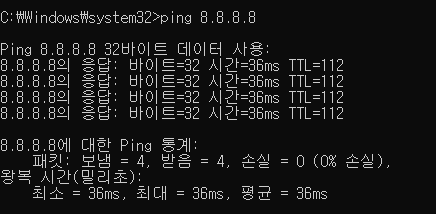
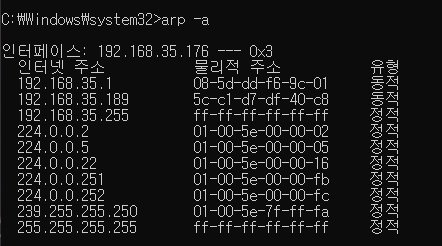
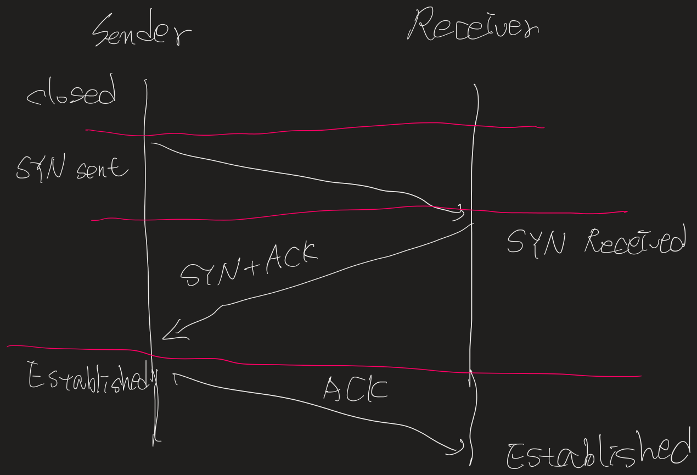
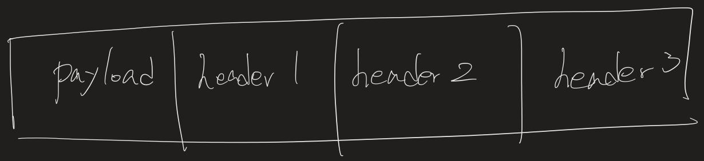
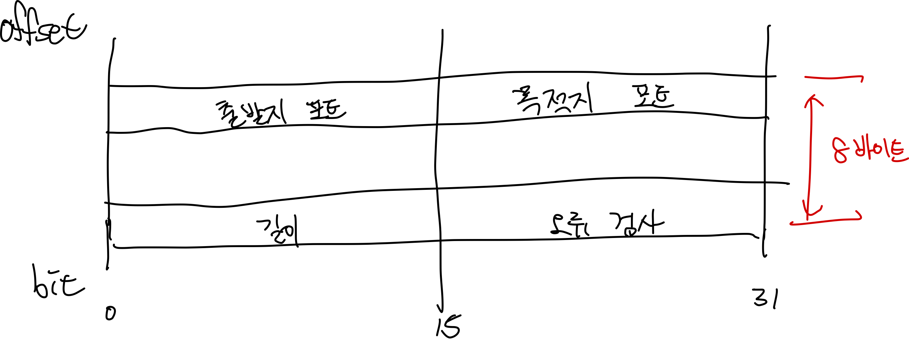
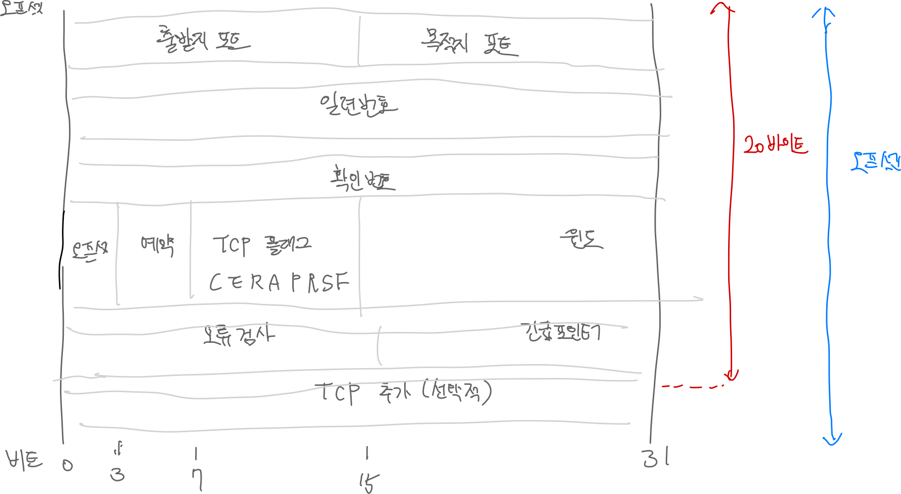

# TCP/IP

---

## IP 주소와 서브넷 마스크 그리고 기본 게이트웨이의 의미

- 이더넷 어뎁터

PC에서 사용하는 LAN 카드, LAN 카드를 NIC(Network Interface Controller)라고도 한다. 이더넷이란 LAN 영역에서 사용하는 통신 기술 중 사실상 표준이다.

- IP 주소

인터넷 공간에서 PC가 사용하는 고유한 식별자이다. IP 주소는 데이터를 송신하는 주체이기 때문에 출발지 주소이다.  127.0.0.1번은 자기의 LAN 카드 자신을 의미하는 루프백 주소이다.

- 서브넷 마스크

IP 주소와 쌍으로 사용하는 개념이다. 192.168.35.176 255.255.255.0 등과 같이 사용한다. IP 주소를 서브넷 마스크를 이용해 표기하는 방식을 서브넷 마스크 표기법이라고 부른다. 위 예에서 192.168.35은 255.255.255에 대응하고 176은 0에 대응한다. 이때 255.255.255번에 대응하는 192.168.0을 네트워크 ID라고 부르고, 13번을 호스트 ID라고 부른다.

- 기본 게이트웨이

게이트웨이를 다른 말로 라우터라고 한다. 게이트웨이는 무선 공유기를 의미하고, 무선 공유기에서 사용하는 IP 주소가 192.168.35.1이다. 라우터는 인터넷 공간에서 각기 다른 호스트 사이를 연결해주는 라우팅을 수행한다.

---

## DHCP 서비스와 DNS 서비스 그리고 물리적 주소의 의미

- DHCP 사용 : PC에서 IP 주소를 유동 IP 방식으로 사용
    - IP 주소는 원래 사용자가 IP 주소와 서브넷 마스크, 기본 게이트웨이 등을 직접 입력해야 하지만 쉽지 않다. DHCP 서비스는 사용할 IP 주소 범위를 서버에 미리 등록하면 PC 사용자에게 IP 주소와 서브넷 마스크, 게이트웨이 IP 주소, DNS 서버 IP 주소를 자동으로 할당해준다.
    - 가정에서 인터넷을 사용하는 초고속 인터넷 가입자는 DHCP 서비스 방식을 이용한다.

- ‘임대 시작 날짜’와 ‘임대 만료 날짜’가 있는데 DHCP 방식에 따라 IP 주소를 할당받은 시간과 IP 주소를 사용한 시간이고 동시에 PC 사용 시간을 의미한다.

- ‘기본 게이트웨이’와 ‘DHCP 서버’의 IP 주소가 같은데 게이트웨이에서 DHCP 기능을 수행한다는 것이다. 다시 말해, 무선 공유기는 게이트웨이 역할과 DHCP 서버 기능도 수행한다.

- DNS 서버 : 두 IP 주소가 보이는데 IPS에서 제공하는 DNS 서버 IP 주소다.
    - DNS 서버는 사용자가 입력한 도메인 네임을 IP 주소로 변환한다.
    - 도메인 네임과 IP 주소의 대응관계를 일종의 DB 형태로 저장해 사용하는 기능이 DNS 서비스

- 물리적 주소: 맥(MAC) 주소라고도 하며 이더넷 어댑터 로컬 영역 연결 부분과 관련이 있다.
    - 맥 주소는 LAN 영역에서 내부 통신을 수행하기 위해 필요한 주소이다.
    - 출발지에서 스위치 장비를 통해 목적지로 이동하고, 이 때 스위치 장비의 내장 테이블에 맥 주소를 저장 및 검색하는데 이 과정을 스위칭이라고 한다.
    - 스위치는 맥 주소 인식을 통해 목적지 맥 주소가 있는 해당 포트로만 데이터를 전송하는데, 이를 포워딩이라고 한다.

---

## ARP 캐시 테이블

ping 명령어는 출발지 호스트와 목적지 호스트 사이에서 회선의 연결 상태나 목적지 운영체제의 동작 여부 등을 점검하기 위한 도구이다.

라우터가 사용하는 192.168.35.1번 IP 주소와 08-5d-dd-f6-9c-01 맥 주소가 대응 관계를 이루고 있다. IP 주소와 맥 주소의 대응 관계를 저장한 테이블을 ARP 캐시 테이블이라고 한다.

| 구분 | 출발지 | 목적지 |
| --- | --- | --- |
| IP 주소 | 192.168.0.13 | 8.8.8.8 |
| MAC 주소 | 00-24-1D-DF-8c-47 |  |

운영체제는 자기의 서브넷 마스크를 가지고 출발지 IP 주소와 목적지 IP 주소를 설정한 뒤 출발지 네트워크 ID와 목적지 네트워크 ID를 비교한다. 출발지와 다른 LAN 영역에 목적지로 데이터를 전송하기 위해 운영체제는 자기의 라우터 IP 주소를 목적지 IP 주소로 변경한다.

| 구분 | 출발지 | 목적지 |
| --- | --- | --- |
| IP 주소 | 192.168.0.13 | 192.168.0.1 |
| MAC 주소 | 00-24-1D-DF-8c-47 |  |

이제 기본 게이트웨이에 해당하는 목적지 맥 주소를 알아야한다. 자기가 속한 LAN 영역 전체를 대상으로 192.168.0.1번에 대응하는 맥 주소를 구하기 위해 ARP 질의를 브로드캐스트 방식으로 전송한다.

LAN 영역의 호스트 중 192.168.0.1번을 사용하는 게이트웨이가 맥 주소를 유니캐스트 방식으로 전송한다.

| 구분 | 출발지 | 목적지 |
| --- | --- | --- |
| IP 주소 | 192.168.0.13 | 192.168.0.1 |
| MAC 주소 | 00-24-1D-DF-8c-47 | 00-26-66-86-f8 |

이처럼 목적지 맥 주소가 저장되면 운영체제에서 ARP 캐시 테이블을 참조해 데이터를 유니캐스트 방식으로 게이트웨이에 전송한다. 이후부터 게이트웨이 IP 주소에 기반한 라우팅 통신을 통해 전송한다.

---

## UDP 방식과 TCP 방식

UDP 방식은 송신 측 호스트에서 송신 데이터가 생기면 곧바로 수신 측 호스트에게 전송을 수행한다. 수신 여부는 고려하지 않고, 전송 중 오류가 생기는 것도 고려하지 않는다.

TCP는 다음과 같이 동작한다.

- TCP는 송신 데이터가 생기면 수신 측 호스트에게 SYN 신호를 보내 동기화를 요청하고 수신 가능 여부를 확인한다.
- 수신측에서 SYN/ACK 신호로 응답을 보낸다. ACK는 송신 요청에 대해 수락을 의미하고, SYN은 수신 측에서 역으로 송신 측에게 동기화를 요청한다.
- 송신 측은 SYN/ACK 신호를 받으면 다시 ACK 신호를 전송한다.

이 3단계 동기화 과정을 마친 뒤 실제 데이터를 주고 받는다.  이 과정은 데이터 전송 과정과 종료에서도 같은 형식을 취한다.

| 단계 | 동작 방식 | 사용 신호 |
| --- | --- | --- |
| 전송 전 | 3단계 열정 설정 수행 | SYN, ACK |
| 전송 중 | 전송 후 응답 신호 수신 대기 | PUSH, ACK |
| 전송 후 | 3/4 단계 연결 종료 수행 | FIN, ACK |

TCP 방식이 3단계 연결 설정과 3/4단계 연결 종료를 수행할 수 있는 이유는 버퍼링 때문이다. UDP 방식은 버퍼링 기능이 없어서 일방적인 전송만을 수행한다. 반면 TCP 방식은 버퍼링 기능이 있어 송신자와 수신자 사이에 상호작용이 가능하다.

---

## 데이터 전송 단위

운영체제가 생성하고 전송하는 데이터 구성을 편지와 비교해보면, 편지지를 페이로드(payload), 편지 봉투를 헤더(header)라고 한다. 페이로드는 편지지와 같이 사용자가 상대방에게 전송하고자 하는 실제 정보가 담긴 공간이고, 헤더는 편지 봉투와 같이 보내는 출발지 주소와 목적지 주소가 담긴 공간이다.

운영체제는 전송할 페이로드를 생성하고, 전송할 내용을 담는다. 페이로드만으로 이루어진 데이터를 메시지라고 부른다. 메시지를 생성하면 헤더가 붙는다. 헤더에는 출발지 포트 번호와 목적지 포트 번호가 담긴다. 이러한 전송 단위를 데이터그램 또는 세그먼트라고 부른다.

단편화는 데이터를 분할한다는 의미인데, UDP 방식에는 없고 TCP 방식에는 있다. 따라서 단편화가 없는 UDP 속성의 페이로드 앞의 헤더가 붙었을 때 데이터그램이라고 하며, 단편화가 있는 TCP 속성의 페이로드 앞에 헤더가 붙었을 때 세그먼트라고 한다.

| 구분 | UDP 방식 | TCP 방식 |
| --- | --- | --- |
| 페이로드 크기 | 512byte 미만 | 512byte 이상 |
| 버퍼링 | 없음 | 있음 |
| 단편화 | 없음 | 있음 |
| 전송 단위 | 데이터그램 | 세그먼트 |

데이터그램의 헤더에 포트 번호를 통해 페이로드의 내용이 어떤 종류의 서비스인지 판단할 수 있다. 데이터그램을 완성하면 새로운 헤더가 붙는다.

두 번째 헤더를 패킷 헤더라고 하며, 출발지 IP 주소와 목적지 IP 주소를 가지고 있다. 웹 브라우저의 주소창에 도메인 네임을 입력하면 DNS 서비스에 의해 IP 주소로 변환한 뒤 패킷 헤더에 담긴다. 라우터 장비가 라우팅 기능을 수행할 때 참조하는 부분이 패킷 헤더다.

패킷을 완성하면 마지막 헤더가 붙는다.

이러한 데이터 전송 단위를 프레임이라고 부른다. 프레임 헤더에는 맥 주소가 담긴다. 또한 스위치 장비가 스위칭 기능을 수행할 때 참조하는 부분도 프레임 헤더다. 프레임 헤더는 스위칭 통신 영역과 라우팅 통신 영역에 있을 때 담는 정보가 다르다. LAN 영역에 있는 경우 맥 주소가 있지만, WAN 영역에 있는 경우 다른 것으로 채워진다.

| 전송 단위 | 헤더 정보 | 비고 |
| --- | --- | --- |
| 메시지 |  | 페이로드 |
| 데이터그램 | 출발지/목적지 포트 번호 |  |
| 패킷 | 출발지/목적지 IP 주소 | 데이터 전송 단위의 총칭 |
| 프레임 | 출발지/목적지 맥 주소 | LAN 영역에 있는 경우 |
|  | WAN 영역에 대한 정보 | WAN 영역에 있는 경우 |

페이로드 앞에 일련의 헤더를 붙이는 과정을 인캡슐레이션이라고 한다. 반대로 헤더를 떼는 과정은 디캡슐레이션이라고 한다. 인캡슐레이션은 OOP에서 말하는 정보 은폐 기법을 의미하기도 한다. 라우터는 오직 패킷 헤더만 읽을 수 있을 뿐 세그먼트/데이터그램 헤더 이하는 읽을 수 없다. 스위치 또한 오직 프레임 헤더만 읽을 뿐 패킷 헤더 이하는 읽을 수 없다.

--- 

## TCP/IP 방식의 계층적 구조

1973년 당시 LAN 영역과 WAN 영역, 스위치 또는 라우터 등이 태동하던 시절이다. 단지 전송과 제어라는 통신의 기본 내용을 인터넷 공간에서 구현하기 위한 구조로 등장한 개념이 TCP/IP 프로토콜이다.

TCP/IP 프로토콜은 5계층을 거쳐 데이터를 전송한다. 송신자 OS는 응용 계층 → 전송 계층 → 네트워크 계층 → 데이터 링크 계층 → 물리 계층 순으로 통과하면서 데이터를 전송한다.

- 송신의 시작인 응용 계층에서 UDP 기반의 페이로드를 생선한 후 사용자의 정보를 저장한다. 응용 계층에서 생선한 전송 단위를 메시지라고 부른다.
- 메시지는 전송 계층으로 넘어가 첫 번째 헤더와 결합한다. 첫 번째 헤더에서 중요한 부분은 포트 번호이고, 이 형태를 데이터그램이라고 부른다.
- 네트워크 계층으로 넘어가 두 번째 헤더와 결합한다. 여기서 중요한 정보는 IP 주소이고, 이러한 전송 단위를 패킷이라고 부른다.
- 데이터 링크 계층으로 넘어가 세 번째 헤더와 결합하고, 여기서 중요한 정보는 MAC 주소이다. 이러한 단위를 프레임이라고 부른다.

| 계층 |  해당 계층에 속하는 프로토콜 |
| --- | --- |
| 응용 | FTP, SSH, TELNET, SMTP, DNS, DHCP, HTTP, POP3, SNMP, SSL 등 |
| 전송 | TCP, UDP |
| 네트워크 | IP, ICMP, IGMP, ARP, RARP |
| 데이터 링크 | 이더넷, PPP 등 |
| 물리 |  |

---

## TCP/IP 방식의 응용 계층

응용 계층에는 이론상 65,536개에 이르는 페이로드 생성 프로토콜이 있다. DNS 또는 HTTP 같은 프로토콜이 바로 TCP/IP 응용 계층에 속한다. 응용 계층에서는 사용자의 정보를 저장하는 페이로드 생성 기능을 수행한다. 이 때 운영체제는 응용 계층에 속하는 프로토콜을 포트 번호로 인식한다.

인터넷에 수많은 LAN 영역을 네트워크 ID로 구분하는 것처럼 응용 계층에 존재하는 수많은 프로토콜은 포트 번호로 구분한다.

포트 번호에는 해당 프로토콜에서 발생한 정보가 흐르는 가상의 통로라는 의미도 있다. SMTP가 사용하는 25번 포트는 전자 우편과 관련된 내용이 담겼고, DNS가 사용하는 53번에는 도메인 네임에대한 질의와 응답 내용이 담겼다.

| 구분 | 명칭 | 비고 |
| --- | --- | --- |
| 0~1,023 | 잘 알려진 포트 | 주로 서버에서 사용 |
| 1,024~49,151 | 등록 포트 번호 | 주로 클라이언트에서 사용 |
| 49,152~65,535 | 사설 또는 동적 포트 번호 | 주로 클라이언트에서 사용 |

포트 스캔이란 원격지 호스트를 대상으로 어떤 포트 번호를 사용하는지 확인하는 기법이다.

---

##TCP/IP 방식의 전송 계층

전송 계층에는 응용 계층과 달리 2개의 프로토콜만 있다. UDP와 TCP이다. UDP 방식과 TCP 방식의 차이점은 버퍼링 유무에 따라 구분한다.

UDP 방식은 응용 계층에서 페이로드를 생성하면 전송 계층에서 페이로드 앞에 포트 번호가 담긴 헤더를 붙인 뒤 네트워크 계층으로 전송 과정을 넘긴다. UDP 방시은 일반적으로 512바이트 미만의 페이로드를 대상으로 오직 전송 과정에만 초점을 두고 개발해서 실시간 요구 환경에 적합하다.

TCP는 전송 전 3당계 연결 설정을 수행해야 한다. 이를 수행하기 위해 TCP 페이로드를 응용 계층 버퍼에 임시로 저장하고 전송 계층에서 SYN 신호를 담은 세그먼트 1개를 생성한다. SYN 세그먼트는 네트워크 계층과 데이터 링크 계층을 차례로 통과하면서 각 헤더를 붙인 뒤 물리 계층에서 비트 단위로 변환해 목적지로 나간다.

| SYN 신호가 담긴 세그먼트 헤더 | IP 패킷 헤더 | 이더넷 프레임 헤더 |
| --- | --- | --- |

수신 측 호스트는 해당 SYN 신호를 전송 계층까지 올린 뒤, 전송 계층에서 SYN/ACK 신호를 담은 세그먼트 1개를 생성해 출발지로 보낸다.

| SYN/ACK 신호가 담긴 세그먼트 헤더 | IP 패킷 헤더 | 이더넷 프레임 헤더 |
| --- | --- | --- |

그러면 송신측 호스트에서도 SYN/ACK 신호를 전송 계층까지 올린 뒤 ACK 신호를 담은 세그먼트 1개를 생성해 목적지로 보낸다. 이것으로 전송전 3단계를 완성한다.

| ACK 신호가 담긴 세그먼트 헤더 | IP 패킷 헤더 | 이던셋 프레임 헤더 |
| --- | --- | --- |

3단계 연결을 확립하면 OS는 응용 계층 버퍼에 저장한 TCP 페이로드를 전송 계층으로 넘긴다. 전송 계층은 TCP 페이로드를 단편화 한다. 단편화가 끝나면 조각난 페이로드 앞에 출발지 포트 번호와 목적지 포트 번호 등이 담긴 헤더가 붙는 세그먼트를 생성한다.

경우에 따라서 전송은 응용 계층에서 시작하는 겨우도 있고 전송 계층에서 시작하는 경우도 있고 네트워크 계층에서 시작하는 경우도 있다. 응용 계층에서 시작한 전송은 상대방 응용 계층에서 끝나고 전송 계층에서 시작한 전송은 상대방 전송 계층에서 끝난다.

UDP 헤더의 크기는 8바이트로 고정이다. 출발지 포트와 목적지 포트 항목은 16비트 크기를 이룬다. 길이 항목에는 UDP 페이로드와 UDP 헤더를 더한 데이터그램 크기 정보가 담긴다. 오류 검사 항목은 기본적으로 비활성 상태다.

TCP 방식은 UDP 방식과 달리 버퍼링과 단순화 기능을 수행하기 때문에 헤더 구조가 상대적으로 복잡하다. TCP 헤더는 일반적으로 20 바이트지만 추가 항목을 이용해 21바이트 이상으로 사용할 수도 있다.

일련번호와 확인 번호 항목은 3단계 연결 설정 등과 관련이 있다. OS는 전송 전 3단계 연결 설정이나 전송 후 3단계 연결 종료 등을 수행할 때 송신자와 수신자 사이에 주고받은 세그먼트의 연속성을 보장하기 위해 일련번호와 확인 번호를 이용한다.

| 구분 | 일련번호 | 확인 번호 | 비고 |
| --- | --- | --- | --- |
| SYN | 0 | 0 | 송신자 |
| SYN/ACK | 0 | 1 | 수신자 |
| ACK | 1 | 1 | 송신자 |

오프셋 항목에는 TCP 헤더의 길이를 담는다.

플래그 항목에는 TCP 3단계 연결 설정이나 전송 후 TCP 3단계 연결 종료 등에 사용하는 SYN, FIN 신호 정보 등을 저장한다.

| 구분 | 의미 |
| --- | --- |
| SYN | 상대방과 동기화 확립 |
| FIN | 상대방과 동기화 해제 |
| ACK | 확인 응답 |
| RST | 상대방과 연결을 강제로 종료 |
| PSH | TCP 페이로드를 포함하는 신호 |
| URG | 긴급 데이터라는 신호 |
| ECN | 혼잡 발생 신호 |
| CWR | 혼잡 윈도 크기 감소 신호 |

윈도 항목은 흐름 제어 기능과 관련이 있다. 플래그 항목과 윈도 항목은 밀접한 관계가 있다. 송신자는 수신자의 확인 응답에 따라 전송할 정보의 양을 조절하는데, 이를 혼잡 윈도라고 한다. 송신자가 전송할 수 있는 동적인 정보의 양을 슬라이딩 윈도라고 한다.

1. 송신자가 1번부터 20번의 데이터를 전송하면 오류를 대비하기 위해 자신의 버퍼에 저장한다.
2. 수신자가 데이터를 정상적으로 수신하면, 수신자는 윈도 항목에 21 숫자를 담아 ACK 플래그로 응답한다. 다음에는 21번부터 데이터를 보내라는 신호다. 그럼 송신자는 1번 부터 20번까지 데이터를 삭제한 뒤 21번부터 60번까지 데이터를 전송하고, 해당 데이터를 다시 버퍼에 저장한다.
3. 만약 혼잡과 부하 등으로 수신자가 21번부터 40번까지만 수신했다면, 윈도 항목에 41번을 담아 ACK/CWR 플래그로 응답한다. 그러면 송신자는 41번부터 60번까지 해당하는 데이터를 재전송한다.

--- 

