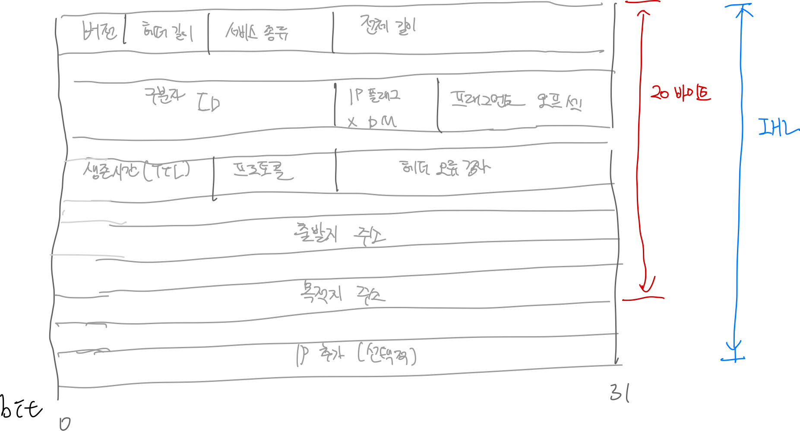
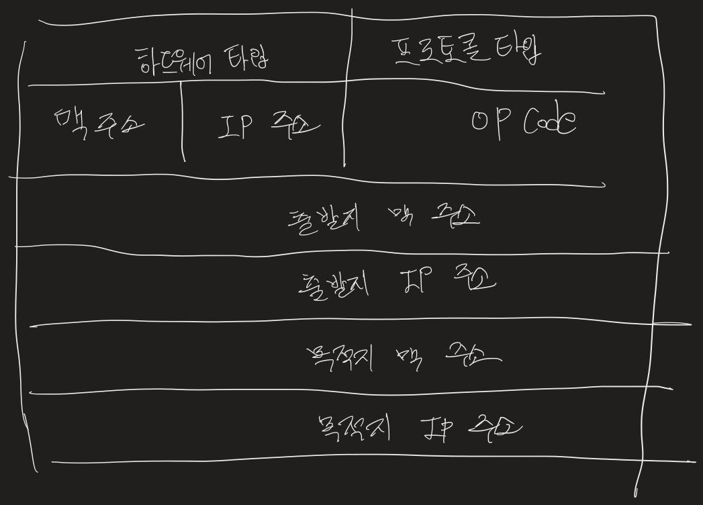

# Network

---

## IP 주소와 서브넷 마스크 그리고 기본 게이트웨이의 의미

- 이더넷 어뎁터

PC에서 사용하는 LAN 카드, LAN 카드를 NIC(Network Interface Controller)라고도 한다. 이더넷이란 LAN 영역에서 사용하는 통신 기술 중 사실상 표준이다.

- IP 주소

인터넷 공간에서 PC가 사용하는 고유한 식별자이다. IP 주소는 데이터를 송신하는 주체이기 때문에 출발지 주소이다.  127.0.0.1번은 자기의 LAN 카드 자신을 의미하는 루프백 주소이다.

- 서브넷 마스크

IP 주소와 쌍으로 사용하는 개념이다. 192.168.35.176 255.255.255.0 등과 같이 사용한다. IP 주소를 서브넷 마스크를 이용해 표기하는 방식을 서브넷 마스크 표기법이라고 부른다. 위 예에서 192.168.35은 255.255.255에 대응하고 176은 0에 대응한다. 이때 255.255.255번에 대응하는 192.168.0을 네트워크 ID라고 부르고, 13번을 호스트 ID라고 부른다.

- 기본 게이트웨이

게이트웨이를 다른 말로 라우터라고 한다. 게이트웨이는 무선 공유기를 의미하고, 무선 공유기에서 사용하는 IP 주소가 192.168.35.1이다. 라우터는 인터넷 공간에서 각기 다른 호스트 사이를 연결해주는 라우팅을 수행한다.

---

## ARP 캐시 테이블

ping 명령어는 출발지 호스트와 목적지 호스트 사이에서 회선의 연결 상태나 목적지 운영체제의 동작 여부 등을 점검하기 위한 도구이다.

라우터가 사용하는 192.168.35.1번 IP 주소와 08-5d-dd-f6-9c-01 맥 주소가 대응 관계를 이루고 있다. IP 주소와 맥 주소의 대응 관계를 저장한 테이블을 ARP 캐시 테이블이라고 한다.

| 구분 | 출발지 | 목적지 |
| --- | --- | --- |
| IP 주소 | 192.168.0.13 | 8.8.8.8 |
| MAC 주소 | 00-24-1D-DF-8c-47 |  |

운영체제는 자기의 서브넷 마스크를 가지고 출발지 IP 주소와 목적지 IP 주소를 설정한 뒤 출발지 네트워크 ID와 목적지 네트워크 ID를 비교한다. 출발지와 다른 LAN 영역에 목적지로 데이터를 전송하기 위해 운영체제는 자기의 라우터 IP 주소를 목적지 IP 주소로 변경한다.

| 구분 | 출발지 | 목적지 |
| --- | --- | --- |
| IP 주소 | 192.168.0.13 | 192.168.0.1 |
| MAC 주소 | 00-24-1D-DF-8c-47 |  |

이제 기본 게이트웨이에 해당하는 목적지 맥 주소를 알아야한다. 자기가 속한 LAN 영역 전체를 대상으로 192.168.0.1번에 대응하는 맥 주소를 구하기 위해 ARP 질의를 브로드캐스트 방식으로 전송한다.

LAN 영역의 호스트 중 192.168.0.1번을 사용하는 게이트웨이가 맥 주소를 유니캐스트 방식으로 전송한다.

| 구분 | 출발지 | 목적지 |
| --- | --- | --- |
| IP 주소 | 192.168.0.13 | 192.168.0.1 |
| MAC 주소 | 00-24-1D-DF-8c-47 | 00-26-66-86-f8 |

이처럼 목적지 맥 주소가 저장되면 운영체제에서 ARP 캐시 테이블을 참조해 데이터를 유니캐스트 방식으로 게이트웨이에 전송한다. 이후부터 게이트웨이 IP 주소에 기반한 라우팅 통신을 통해 전송한다.

---

## UDP 방식과 TCP 방식

UDP 방식은 송신 측 호스트에서 송신 데이터가 생기면 곧바로 수신 측 호스트에게 전송을 수행한다. 수신 여부는 고려하지 않고, 전송 중 오류가 생기는 것도 고려하지 않는다.

TCP는 다음과 같이 동작한다.

- TCP는 송신 데이터가 생기면 수신 측 호스트에게 SYN 신호를 보내 동기화를 요청하고 수신 가능 여부를 확인한다.
- 수신측에서 SYN/ACK 신호로 응답을 보낸다. ACK는 송신 요청에 대해 수락을 의미하고, SYN은 수신 측에서 역으로 송신 측에게 동기화를 요청한다.
- 송신 측은 SYN/ACK 신호를 받으면 다시 ACK 신호를 전송한다.

이 3단계 동기화 과정을 마친 뒤 실제 데이터를 주고 받는다.  이 과정은 데이터 전송 과정과 종료에서도 같은 형식을 취한다.

| 단계 | 동작 방식 | 사용 신호 |
| --- | --- | --- |
| 전송 전 | 3단계 열정 설정 수행 | SYN, ACK |
| 전송 중 | 전송 후 응답 신호 수신 대기 | PUSH, ACK |
| 전송 후 | 3/4 단계 연결 종료 수행 | FIN, ACK |

TCP 방식이 3단계 연결 설정과 3/4단계 연결 종료를 수행할 수 있는 이유는 버퍼링 때문이다. UDP 방식은 버퍼링 기능이 없어서 일방적인 전송만을 수행한다. 반면 TCP 방식은 버퍼링 기능이 있어 송신자와 수신자 사이에 상호작용이 가능하다.

---

## 데이터 전송 단위

운영체제가 생성하고 전송하는 데이터 구성을 편지와 비교해보면, 편지지를 페이로드(payload), 편지 봉투를 헤더(header)라고 한다. 페이로드는 편지지와 같이 사용자가 상대방에게 전송하고자 하는 실제 정보가 담긴 공간이고, 헤더는 편지 봉투와 같이 보내는 출발지 주소와 목적지 주소가 담긴 공간이다.

운영체제는 전송할 페이로드를 생성하고, 전송할 내용을 담는다. 페이로드만으로 이루어진 데이터를 메시지라고 부른다. 메시지를 생성하면 헤더가 붙는다. 헤더에는 출발지 포트 번호와 목적지 포트 번호가 담긴다. 이러한 전송 단위를 데이터그램 또는 세그먼트라고 부른다.

단편화는 데이터를 분할한다는 의미인데, UDP 방식에는 없고 TCP 방식에는 있다. 따라서 단편화가 없는 UDP 속성의 페이로드 앞의 헤더가 붙었을 때 데이터그램이라고 하며, 단편화가 있는 TCP 속성의 페이로드 앞에 헤더가 붙었을 때 세그먼트라고 한다.

| 구분 | UDP 방식 | TCP 방식 |
| --- | --- | --- |
| 페이로드 크기 | 512byte 미만 | 512byte 이상 |
| 버퍼링 | 없음 | 있음 |
| 단편화 | 없음 | 있음 |
| 전송 단위 | 데이터그램 | 세그먼트 |

데이터그램의 헤더에 포트 번호를 통해 페이로드의 내용이 어떤 종류의 서비스인지 판단할 수 있다. 데이터그램을 완성하면 새로운 헤더가 붙는다.

두 번째 헤더를 패킷 헤더라고 하며, 출발지 IP 주소와 목적지 IP 주소를 가지고 있다. 웹 브라우저의 주소창에 도메인 네임을 입력하면 DNS 서비스에 의해 IP 주소로 변환한 뒤 패킷 헤더에 담긴다. 라우터 장비가 라우팅 기능을 수행할 때 참조하는 부분이 패킷 헤더다.

패킷을 완성하면 마지막 헤더가 붙는다.

이러한 데이터 전송 단위를 프레임이라고 부른다. 프레임 헤더에는 맥 주소가 담긴다. 또한 스위치 장비가 스위칭 기능을 수행할 때 참조하는 부분도 프레임 헤더다. 프레임 헤더는 스위칭 통신 영역과 라우팅 통신 영역에 있을 때 담는 정보가 다르다. LAN 영역에 있는 경우 맥 주소가 있지만, WAN 영역에 있는 경우 다른 것으로 채워진다.

| 전송 단위 | 헤더 정보 | 비고 |
| --- | --- | --- |
| 메시지 |  | 페이로드 |
| 데이터그램 | 출발지/목적지 포트 번호 |  |
| 패킷 | 출발지/목적지 IP 주소 | 데이터 전송 단위의 총칭 |
| 프레임 | 출발지/목적지 맥 주소 | LAN 영역에 있는 경우 |
|  | WAN 영역에 대한 정보 | WAN 영역에 있는 경우 |

페이로드 앞에 일련의 헤더를 붙이는 과정을 인캡슐레이션이라고 한다. 반대로 헤더를 떼는 과정은 디캡슐레이션이라고 한다. 인캡슐레이션은 OOP에서 말하는 정보 은폐 기법을 의미하기도 한다. 라우터는 오직 패킷 헤더만 읽을 수 있을 뿐 세그먼트/데이터그램 헤더 이하는 읽을 수 없다. 스위치 또한 오직 프레임 헤더만 읽을 뿐 패킷 헤더 이하는 읽을 수 없다.

--- 

## TCP/IP 방식의 계층적 구조

1973년 당시 LAN 영역과 WAN 영역, 스위치 또는 라우터 등이 태동하던 시절이다. 단지 전송과 제어라는 통신의 기본 내용을 인터넷 공간에서 구현하기 위한 구조로 등장한 개념이 TCP/IP 프로토콜이다.

TCP/IP 프로토콜은 5계층을 거쳐 데이터를 전송한다. 송신자 OS는 응용 계층 → 전송 계층 → 네트워크 계층 → 데이터 링크 계층 → 물리 계층 순으로 통과하면서 데이터를 전송한다.

- 송신의 시작인 응용 계층에서 UDP 기반의 페이로드를 생선한 후 사용자의 정보를 저장한다. 응용 계층에서 생선한 전송 단위를 메시지라고 부른다.
- 메시지는 전송 계층으로 넘어가 첫 번째 헤더와 결합한다. 첫 번째 헤더에서 중요한 부분은 포트 번호이고, 이 형태를 데이터그램이라고 부른다.
- 네트워크 계층으로 넘어가 두 번째 헤더와 결합한다. 여기서 중요한 정보는 IP 주소이고, 이러한 전송 단위를 패킷이라고 부른다.
- 데이터 링크 계층으로 넘어가 세 번째 헤더와 결합하고, 여기서 중요한 정보는 MAC 주소이다. 이러한 단위를 프레임이라고 부른다.

| 계층 |  해당 계층에 속하는 프로토콜 |
| --- | --- |
| 응용 | FTP, SSH, TELNET, SMTP, DNS, DHCP, HTTP, POP3, SNMP, SSL 등 |
| 전송 | TCP, UDP |
| 네트워크 | IP, ICMP, IGMP, ARP, RARP |
| 데이터 링크 | 이더넷, PPP 등 |
| 물리 |  |

---

## TCP/IP 방식의 응용 계층

응용 계층에는 이론상 65,536개에 이르는 페이로드 생성 프로토콜이 있다. DNS 또는 HTTP 같은 프로토콜이 바로 TCP/IP 응용 계층에 속한다. 응용 계층에서는 사용자의 정보를 저장하는 페이로드 생성 기능을 수행한다. 이 때 운영체제는 응용 계층에 속하는 프로토콜을 포트 번호로 인식한다.

인터넷에 수많은 LAN 영역을 네트워크 ID로 구분하는 것처럼 응용 계층에 존재하는 수많은 프로토콜은 포트 번호로 구분한다.

포트 번호에는 해당 프로토콜에서 발생한 정보가 흐르는 가상의 통로라는 의미도 있다. SMTP가 사용하는 25번 포트는 전자 우편과 관련된 내용이 담겼고, DNS가 사용하는 53번에는 도메인 네임에대한 질의와 응답 내용이 담겼다.

| 구분 | 명칭 | 비고 |
| --- | --- | --- |
| 0~1,023 | 잘 알려진 포트 | 주로 서버에서 사용 |
| 1,024~49,151 | 등록 포트 번호 | 주로 클라이언트에서 사용 |
| 49,152~65,535 | 사설 또는 동적 포트 번호 | 주로 클라이언트에서 사용 |

포트 스캔이란 원격지 호스트를 대상으로 어떤 포트 번호를 사용하는지 확인하는 기법이다.

---

##TCP/IP 방식의 전송 계층

전송 계층에는 응용 계층과 달리 2개의 프로토콜만 있다. UDP와 TCP이다. UDP 방식과 TCP 방식의 차이점은 버퍼링 유무에 따라 구분한다.

UDP 방식은 응용 계층에서 페이로드를 생성하면 전송 계층에서 페이로드 앞에 포트 번호가 담긴 헤더를 붙인 뒤 네트워크 계층으로 전송 과정을 넘긴다. UDP 방시은 일반적으로 512바이트 미만의 페이로드를 대상으로 오직 전송 과정에만 초점을 두고 개발해서 실시간 요구 환경에 적합하다.

TCP는 전송 전 3당계 연결 설정을 수행해야 한다. 이를 수행하기 위해 TCP 페이로드를 응용 계층 버퍼에 임시로 저장하고 전송 계층에서 SYN 신호를 담은 세그먼트 1개를 생성한다. SYN 세그먼트는 네트워크 계층과 데이터 링크 계층을 차례로 통과하면서 각 헤더를 붙인 뒤 물리 계층에서 비트 단위로 변환해 목적지로 나간다.

| SYN 신호가 담긴 세그먼트 헤더 | IP 패킷 헤더 | 이더넷 프레임 헤더 |
| --- | --- | --- |

수신 측 호스트는 해당 SYN 신호를 전송 계층까지 올린 뒤, 전송 계층에서 SYN/ACK 신호를 담은 세그먼트 1개를 생성해 출발지로 보낸다.

| SYN/ACK 신호가 담긴 세그먼트 헤더 | IP 패킷 헤더 | 이더넷 프레임 헤더 |
| --- | --- | --- |

그러면 송신측 호스트에서도 SYN/ACK 신호를 전송 계층까지 올린 뒤 ACK 신호를 담은 세그먼트 1개를 생성해 목적지로 보낸다. 이것으로 전송전 3단계를 완성한다.

| ACK 신호가 담긴 세그먼트 헤더 | IP 패킷 헤더 | 이던셋 프레임 헤더 |
| --- | --- | --- |

3단계 연결을 확립하면 OS는 응용 계층 버퍼에 저장한 TCP 페이로드를 전송 계층으로 넘긴다. 전송 계층은 TCP 페이로드를 단편화 한다. 단편화가 끝나면 조각난 페이로드 앞에 출발지 포트 번호와 목적지 포트 번호 등이 담긴 헤더가 붙는 세그먼트를 생성한다.

경우에 따라서 전송은 응용 계층에서 시작하는 겨우도 있고 전송 계층에서 시작하는 경우도 있고 네트워크 계층에서 시작하는 경우도 있다. 응용 계층에서 시작한 전송은 상대방 응용 계층에서 끝나고 전송 계층에서 시작한 전송은 상대방 전송 계층에서 끝난다.

UDP 헤더의 크기는 8바이트로 고정이다. 출발지 포트와 목적지 포트 항목은 16비트 크기를 이룬다. 길이 항목에는 UDP 페이로드와 UDP 헤더를 더한 데이터그램 크기 정보가 담긴다. 오류 검사 항목은 기본적으로 비활성 상태다.

TCP 방식은 UDP 방식과 달리 버퍼링과 단순화 기능을 수행하기 때문에 헤더 구조가 상대적으로 복잡하다. TCP 헤더는 일반적으로 20 바이트지만 추가 항목을 이용해 21바이트 이상으로 사용할 수도 있다.

일련번호와 확인 번호 항목은 3단계 연결 설정 등과 관련이 있다. OS는 전송 전 3단계 연결 설정이나 전송 후 3단계 연결 종료 등을 수행할 때 송신자와 수신자 사이에 주고받은 세그먼트의 연속성을 보장하기 위해 일련번호와 확인 번호를 이용한다.

| 구분 | 일련번호 | 확인 번호 | 비고 |
| --- | --- | --- | --- |
| SYN | 0 | 0 | 송신자 |
| SYN/ACK | 0 | 1 | 수신자 |
| ACK | 1 | 1 | 송신자 |

오프셋 항목에는 TCP 헤더의 길이를 담는다.

플래그 항목에는 TCP 3단계 연결 설정이나 전송 후 TCP 3단계 연결 종료 등에 사용하는 SYN, FIN 신호 정보 등을 저장한다.

| 구분 | 의미 |
| --- | --- |
| SYN | 상대방과 동기화 확립 |
| FIN | 상대방과 동기화 해제 |
| ACK | 확인 응답 |
| RST | 상대방과 연결을 강제로 종료 |
| PSH | TCP 페이로드를 포함하는 신호 |
| URG | 긴급 데이터라는 신호 |
| ECN | 혼잡 발생 신호 |
| CWR | 혼잡 윈도 크기 감소 신호 |

윈도 항목은 흐름 제어 기능과 관련이 있다. 플래그 항목과 윈도 항목은 밀접한 관계가 있다. 송신자는 수신자의 확인 응답에 따라 전송할 정보의 양을 조절하는데, 이를 혼잡 윈도라고 한다. 송신자가 전송할 수 있는 동적인 정보의 양을 슬라이딩 윈도라고 한다.

1. 송신자가 1번부터 20번의 데이터를 전송하면 오류를 대비하기 위해 자신의 버퍼에 저장한다.
2. 수신자가 데이터를 정상적으로 수신하면, 수신자는 윈도 항목에 21 숫자를 담아 ACK 플래그로 응답한다. 다음에는 21번부터 데이터를 보내라는 신호다. 그럼 송신자는 1번 부터 20번까지 데이터를 삭제한 뒤 21번부터 60번까지 데이터를 전송하고, 해당 데이터를 다시 버퍼에 저장한다.
3. 만약 혼잡과 부하 등으로 수신자가 21번부터 40번까지만 수신했다면, 윈도 항목에 41번을 담아 ACK/CWR 플래그로 응답한다. 그러면 송신자는 41번부터 60번까지 해당하는 데이터를 재전송한다.

--- 

## TCP/IP 방식의 네트워크 계층

네트워크 계층에서는 각 세그먼트 앞에 IP 주소를 주요 정보로 하는 헤더를 추가하면서 패킷을 생성한다.

- IP 헤더에서 제일 먼저 버전 항목을 확인할 수 있다. IPv4 주소라면 4가 들어가고, IPv6 주소라면 6이 들어간다.
- 헤더 길이 항목에는 IP 헤더의 크기가 들어간다.
- 서비스 종류 항목에는 해당 패킷의 전송 우선순위를 저장한다. ToS 기능을 지정하면 우선순위를 설정해 회선이 혼잡할 경우에도 해당 패킷을 우선적으로 전송한다.
- 전체 길이 항목에는 IP 헤더를 포함한 패킷 전체의 길이 정보가 담긴다.
- ID, IP 플래그, 프래그먼트 오프셋 항목은 MTU에 따른 패킷 분할 정보를 담는 항목이다. MTU는 최대 전송 단위, 각 프로토콜에서 정한 데이터 크기의 최대 범위를 뜻한다.
- 생존 시간 항목은 라우팅 루프가 일어난 구간에서 패킷을 폐기하기 위한 용도로 사용한다. 해당 패킷이 통과할 수 있는 라우터의 개수 정보를 담는 항목이다.
- 프로토콜 항목은 상위 계층에 속한 프로토콜 번호를 저장한다. UDP 페이로드면 17, TCP 페이로드면 6으로 설정한다.
- 헤더 오류 검사는 UDP/TCP 헤더와 마찬가지로 비활성 상태다.

### 패킷 분할

이더넷 방식에서 MTU는 1,500 바이트다. 만약 5,900 바이트 크기의 데이터가 발생하면 ID 항목, 플래그 항목 프래그먼트 오프셋 항목을 이용해 해결한다. 플래그 항목에서 사용하는 비트 D는 ‘Do not fragment’의 뜻이고, M은 ‘More fragments’를 의미한다. 5,900바이트 크기의 패킷은 100바이트 크기의 쓰레기 값을 채운다. 이를 패딩이라고 한다. 그 다음 OS는 쓰레기 값을 포함한 6,000바이트 크기의 패킷을 각각 1,500바이트로 분할한다. 그 후 이더넷 구간을 통과시킨다.

| ID 항목 | 플래그 항목(D 비트) | 플래그 항목(M 비트) | 프래그먼트 오프셋 |
| --- | --- | --- | --- |
| 1234 | 0 | 1 | 0 |
| 1234 | 0 | 1 | 1,500 |
| 1234 | 0 | 1 | 3,000 |
| 1234 | 0 | 0 | 4,500 |

## IP 주소

사설 IP 주소는 LAN 전용 주소다.  사설 IP 주소는 LAN 영역에서 전용으로 사용하는 주소임에도 실제 인터넷에 접속할 수 있는데, NAT 기법을 사용하기 때문에 가능하다. NAT란 출발 사설 IP를 공인 IP 주소로 바꾸는 기법이다. 보통 라우터(무선 공유기) 같은 장비에서 이용한다. NAT 기법에 포트 번호 주소를 연동해 사용할 경우 PAT라고 한다. PAT를 이용하면 1개의 공인 IP 주소에 65,536개의 사설 IP 주소를 연결할 수 있다.

사설 IP 주소는 외부에서 접근할 수 없다. 사설 IP 주소를 사용하여 웹 서버를 구축했다면 포트 포워딩이란 PAT 기법을 응용해 외부에서 내부로 접근할수 있도록 한다.

### ICMP (Internet Control Message Protocol )

ICMP는 IP 등장 이후 전송 작업을 화면에 출력하기 위한 용도로 등장했다. ping 명령어 결과를 화면으로 볼 수 있는 이유도 ICMP가 동작하기 때문이다. ICMP 방식의 오류 통보란 전송 중 일어날 수 있는 목적지 도달 불가나 발신지 억제 또는 시간 초과나 매개변수의 문제 등을 사용자 화면에 출력하기 위한 기능이다.

목적지 호스트로 ICMP 질의를 요청하면 쓰레기 값으로 채워진 페이로드를 생성한다. ICMP 프로토콜은 네트워크 계층에서부터 페이로드를 생성한다. 그 다음 8바이트 크기의 ICMP 헤더가 붙는다. ICMP 헤더에는 ICMP가 요청인지, 응답인지를 구분하는 정보가 담긴다.

---

## TCP/IP 방식의 데이터 링크 계층

데이터 링크 계층은 네트워크 계층에서 넘어온 패킷을 기반으로 프레임 전송 단위를 형성한다. 원래 TCP/IP 방식은 응용 계층과 전송 계층, 네트워크 계층으로 이루어진 구조였다. 이후 LAN/WAN 기술이 발전하면서 새롭게 구성한 계층이 데이터 링크 계층이다.

스위칭 통신을 구현하는 LAN 영역에서 사용하는 프로토콜에는 이더넷 방식, 토큰링, FDDI(Fiber Distributed Data Interface) 그리고 LAN/WAN 영역을 통합한 ATM(Asynchronous Transfer Mode) 방식 등이 있다. 오늘늘은 이더넷 방식이 LAN 영역에 사실상 표준으로 자리 잡았다.

라우팅 통신을 구현하는 WAN 영역에서는 HDLC(High-Level Data Link Control), PPP(Point-to-Point Protocol), 그리고 가상 회선에 기반해 구현한 X.25, 프레임 릴렝, ATM 방식 등이 있다. LAN 영역과 달리 WAN 에는 사실상 표준이 없어 상대방 라우터와 연동 시 프로토콜 설정에 주의해야 한다.

| 헤더 구분 | 생성 계층 | 주요 정보 | 헤더 크기 | 비고 |
| --- | --- | --- | --- | --- |
| UDP | 전송 | 포트 번호 | 8 바이트 |  |
| TCP | 전송 | 포트 번호 | 20 바이트 |  |
| IP | 네트워크 | IP 주소 | 20 바이트 |  |
| ICMP | 네트워크 |  | 8 바이트 |  |
| ARP | 네트워크 | IP/맥 주소 | 28 바이트 | 페이로드 없음 |

ARP 헤더에는 IP 주소와 맥 주소가 있다. 데이터 링크 계층을 생성하면서 LAN 영역에서 사용하는 맥 주소와 네트워크 계층에서 사용하는 IP 주소의 연결을 위해 설계했다. ARP 프로토콜에는 페이로드 영역이 없이 오직 헤더로만 이루어진 구조이다. ARP 헤더 구조는 다음과 같다.

---

## 인터넷

### 인터넷에서 일어나는 일

인터넷은 큰 TCP/IP 네트워크이다. 인터넷에 참여하는 모든 컴퓨터는 참여하고 있는 활동을 위해 설계된 소프트웨어를 실행하고 있다. 네트워크는 TCP/IP 소프트웨어 같은 프로토콜 소프트웨어가 필요하고, 연결의 끝 지점에서 서로 통신하기 위해 제작된 애플리케이션이 있어야한다. 클라이언트 애플리케이션은 서버 컴퓨터의 서버 애플리케이션과 상호 작용하기 위해 만들어졌으며, 서버 애플리케이션은 클라이언트의 요청을 수신하고, 응답하기 위해 만들어졌다.
   
사용자는 전 세계에 있는 수천 대의 서버에 접속할 수 있으며, DNS 서버의 계층은 대상 도메인 이름을 IP 주소로 확인하며, 클라이언트 소프트웨어는 연결을 설정, 서버는 사용자가 사용하는 것을 제공한다.

   
IP주소나 도메인 이름은 호스트를 찾아낼 수 있으며, 포트 번호는 호스트에서 실행 중인 서비스를 짚어낼 수 있다.

### URI와 URL
클라이언트가 요청하는것은 무엇일지, 서버는 무엇을 할지, 클라이언트가 출력을 요청하는 입력이 있는지 인터넷 리소스를 요청하기 위한 표준 형식을 제공하는것의 중요성이 있다.  
가장 친숙한 요청 형식은 URL(Uniform Resource Locator,유일 자원 지시자)이다. 이는 웹 주소 형식으로 가장 잘 알려져 있다. URL은 URI(Uniform Resource Identifier)로 불리는 더 일반적인 형식의 특별한 경우이다. 모든 요청이 하나의 위치를 가리키는 것이 아니기 때문에 Locator라는 용어보다 Identifier라는 용어가 더 적절하다.  

URI는 인터넷 리소스를 식별하기 위해 사용되는 텍스트 문자열이고, URL은 리소스 위치에 중점을 두는 URI의 서브 카테고리이다.

#### URL의 형식
URL의 일반적인 형식은 scheme://authority/path?query#fragment 의 형식이다  
- scheme : 요청을 해석하기 위해 시스템을 식별. 종종 프로토콜과 관련이 있으며, 전통적인 http 스킴은 웹 URL과 함께 사용.

- //authority : 이중 슬래시로 시작하는 권한은 URL에 지정된 서비스에 접근하기 위해 필요한 정보를 제공 권한의 구셩 요소는 사용자 이름(선택사항), 비밀번호(선택사항), 호스트(요청한 서비스를 가진 컴퓨터, 호스트를 IP 주소나 DNS이름으로 명시할 수도 있다.), 포트(주소를 수신하는 서비스의 포트 번호, 서비스가 잘 알려진 포트를 사용하고 있다면 포트 번호는 생략, HTTP 서비스는 기본적으로 포트 80을 사용하기 때문에 특별하게 구성된 웹서버를 참고하지 않는다면 명시할 필요가 없음)를 포함한다. 
ex) //user:password@host:port_number

- 경로 구성 요소 : 디렉터리의 계층을 통해 요청받은 대상 파일을 가리킨다. http 스킴에는 경로가 생략되면 해당 요청은 기본적으로 도메인의 홈페이지를 가리킨다.

- 퀴리 구성 요소 : 요청 및 다른 정보를 네트워크 서비스로 전달하기 위해 사용. 쿼리 문자열은 보통 & 또는 ; 으로 구분된 속성-값 쌍으로 구성되어 있어 서버로 전달되 처리된다.

- fragment : 해시 다음에 나오는 프레그먼트 섹션은 문서 내의 섹션 제목과 같은 보조 리소스를 지정한다. 프레그먼트 지정시 서버는 일반적으로 완전한 문서를 전송하고 웹브라우저는 리소스 내에서 프래그먼트를 찾는다.

---

## TCP/IP 방식의 물리 계층

물리 계층에서는 기계적, 전기적, 절차적 기능 등을 정의한다. 물리 계층에 해당하는 장치는 UTP 회선과 처리에 적합한 비트 신호를 전송에 적합한 비트로 변환해주는 DCE 장치, 허브가 있다. 무선 공유기도 허브 장비의 기능을 수행한다.

| 구분 | 관련 계층 | 처리 단위 | 테이블 유무 | 동작 방식 |
| --- | --- | --- | --- | --- |
| 허브 | 물리 | 비트 |  | 플러딩 |
| 스위치 | 데이터 링크 | 프레임 | 스위칭 테이블 | 포워딩, 플러딩 |
| 라우터 | 네트워크 | 패킷 | 라우팅 테이블 | 포워딩 |

PC 에서 발생한 비트가 회선을 타고 허브에 도착한다. 허브는 물리 계층에서 비트 단위를 처리하는 장치여서 비트 단위로 들어온 신호를 1번 포트에서 수신한 뒤 1번 포트를 제외한 모든 포트로 비트 단위를 플러딩한다. 허브는 전송을 위한 주소 테이블이 없어서 비트를 수신한 포트를 제외하고 나머지 포트로만 플러딩해 스위치로 흘러간다.

스위치는 데이터 링크 계층에서 프레임 단위를 처리한다. 비트 단위로 들어온 신호를 수신한 뒤 프레임으로 디캡슐레이션한다. 스위치 OS는 프레임 헤더에 담긴 목적지 맥 주소가 자신의 스위칭 테이블에 있는지 여부를 검색한다. 검색 후 프레임을 다시 비트로 변환한 뒤 특정 포트로만 비트 신호를 포워딩한다. 이 때 목적지 맥 주소를 제외한 나머지 포트로 비트 신호가 넘치지 못하도록 블로킹 처리한다.

스위치의 포워딩 동작에 따라 비트 신호는 라우터의 이더넷 인터페이스로 흘러간다. 라우터는 네트워크 계층에서 패킷 단위를 처리하는 장치여서 비트 단위로 들어온 신호를 포트에서 수신한 뒤 프레임으로 변환해 자신의 이더넷 인터페이스에 새겨진 맥 주소와 프레임 헤더의 목적지 맥 주소를 비교한다. 일치할 경우 프레임을 패킷으로 변환한다. 라우터 OS는 패킷 헤더에 담긴 목적지 IP 주소가 자신의 라우팅 테이블에 있는지 여부를 검색한다. 목적지 IP 주소를 검색했다면 해당 인터페이스로 포워딩하기 위해 패킷을 프레임으로 변환한 뒤 프레임 헤더에는 맥 주소가 아닌 PPP 정보를 삽입한다.

PPP 정보를 담은 프레임은 비트로 최종 변환한 뒤 해당 경유지 인터페이스를 타고 목적지 라우터로 흘러간다.

---

## HTTP, HTTPS

### HTTP
HTTP는 본질적으로 하이퍼텍스트 마크업 언어 형식으로 데이터와 이미지를 전송하고 요청하기 위한 응용 계층 프로토콜. 클라이언트와 서버가 자원을 주고 받을때 사용하는 통신 규약. 웹 사이트는 HTTP를 통해 접근할 수 있는 파일, 링크, 다른 리소스의 디렉터리이다. 

HTTP 1.1은 수년간 지배적인 HTML 버전이었는데 2015년에 HTTP/2의 새로운 버전이 나왔다. HTML을 통해 콘텐츠를 전송하는 과정은 깔끔하지만, HTTP/2는 성능을 높이기 위해 전송할때 복잡한 과정이 추가된다. 

HTTP는 HTML 문서를 전송하는게 목적인 응용 계층 수준의 프로토콜. 클라이언트 및 서버 애플리케이션은 TCP 전송 프로토콜을 사용해 연결을 설정한다.

#### HTTP의 역할
1) 클라이언트와 서버를 연결한다
2) 세션에 대한 설정을 지정하고 매개변수를 설정한다.
3) HTML 콘텐츠를 순서대로 전송한다
4) 서버와의 연결을 종료한다.

#### HTTP 통신 과정
1) 브라우저에 URL을 입력
2) 브라우저는 먼저 URL 스킴을 체크해 프로토콜을 결정
3) 브라우저에서 HTTP 사이트의 리소스를 참조한다고 판단.
4) URL에서 DNS 이름을 추출하고 이름을 확인.
5) 클라이언트 컴퓨터는 이름 서버에 DNS 룩업 요청을 보내고, 서버의 IP 주소를 수신.
6) 서버의 IP 주소로 서버와 TCP 연결을 시작
7) TCP 연결 설정 이후 브라우저는 GET 명령으로 서버에 웹 페이지 요청
> 옵션 필드 값 쌍을 GET 명령어 뒤에 사용해서 언어, 브라우저 유형 및 허용 가능한 파일 유형과 같은 설정가능.
8) 서버의 응답은 status-code, reason-pharse를 포함한 형식.

 HTTP 헤더 필드 일부
> | 필드 | 설명 |
> | --- | --- |
> | Content-Length | 콘텐츠 객체의 크기 |
> | Content-Encoding | 메시지와 관련된 인코딩 유형 |
> | Date | 객체가 생성된 날짜 |
> | Last-modified date | 객체가 마지막으로 수정된 날짜 |
> | Content-Language | 객체에 적힌 언어 |

 일부 헤더 필드는 정보 제공을 위한것이고, 다른 헤더 필드는 수신 HTML 문서를 분석하고 처리하기 위해 사용되는 정보를 포함.  
초기 HTTP 1.0에서는 각 요청/응답 주기는 새로운 TCP 연결이 필요했다.(클라이언트는 연결 후 요청 시작, 서버는 요청을 처리후 연결 종료) 서버가 TCP연결을 종료 했기 때문에 클라이언트는 서버가 언제 데이터 송신을 중단하는 지 알 수 있었다. 하지만 지속전인 연결과 종료에 오버헤드가 증가했다. HTTP 1.1에서 클라이언트와 서버는 단일 전송보다 더 길게 연결을 유지할 수 있다. 이때 클라이언트는 단일 응답이 종료하는 시점을 알아는것이 필요한데, Content-Length 필드는 응답과 관련된 HTML 객체의 길이를 지정하여 서버가 송신 객체의 길이를 알지 못하면, 서버는 헤더 필드 Connection:close를 보내서 서버가 연결을 종료해 데이터 끝을 명시함을 알린다.  
HTTP는 서버와 브라우저가 특정 형식 및 환경 설정 옵션을 공통으로 설정하는데 협상 단계를 지원  

HTTP/2는 성능의 이유로 개발되어 HTTP 1.1의 구문 또는 메소드를 변경하지 않는다. 
HTTP/2의 장점
- 연결 내 평행 프로세싱 : HTTP 1.1은 브라우저가 동시에 여러 개와 연결할 수 있지만 각각 한번에 하나의 요청만 응답할 수 있지만, HTTP/2는 서버가 동일한 연결을 통해 한번에 여러 요청을 처리할 수 있다.
- 헤더 압축 : 새로운 연결이 시작될때 전송되는 헤더 정보는 응답 시간을 상당히 지연시켜서, 압축을 통해 헤더 데이터의 전체 크기를 줄일 수 있다.
- 서버 푸쉬 응답 : 서버는 요청을 기다리기 전에 콘텐츠를 제공할 수 있다. 서버는 각 항목에 대한 요청을 기다리는 것보다 추가 항목에 대한 요청을 예상해서 콘텐츠를 푸쉬할 수 있다.  
HTTP/2에는 암호화가 필요하지 않지만 암호화를 강력하게 지원하여 TLS 암호화에 대한 표준 프로필 제공 

 상태코드는 상태를 설명하는 3자리 숫자
> | 상태코드 | 설명 |
> | --- | --- |
> | 100 | 정보제공 |
> | 200 | 성공 |
> | 300 | 리다이렉션 |
> | 400 | 클라이언트 오류 |
> | 500 | 서버 오류 |

### HTTPS
TLS 암호화가 있는 HTTP 웹 프로토콜의 버전. 텍스트를 암호화 한다

---

## OSI 7 계층

OSI 7계층은 참조형 모델이고 실제로 사용하는 프로토콜은 TCP/IP 프로토콜 스택으로 구현되어 있다.

### 1계층 (피지컬 계층)

전기 신호를 전달하는 데 초점이있다. 주요 장비로는 허브, 리피터, 케이블, 커넥터, 트랜시버, 탭이 있다. 1계층에서는 들어온 전기 신호를 잘 전달하는 것이 목적이므로 전기 신호가 1계층 장비에 들어오면 이 전기 신호를 재생성하여 내보낸다.

- 허브, 리피터: 네트워크 통신을 중재하는 네트워크 장비
- 케이벌, 커넥터: 케이블
- 트랜시버: 컴퓨터의 랜 카드와 케이블을 연결하는 장치
- 탭: 네트워크 모니터링과 패킷 분석을 위해 전기 신호를 다른 장비로 복제

### 2계층 (데이터 링크 계층)

전기 신호를 모아 알아볼 수 있는 데이터 형태로 처리한다. 주소 정보를 정의하고 정확한 주소로 통신이 되도록 하는 데 초점이 있다. 1계층에서는 전기 신호를 잘 보내는 것이 목적이므로 출발지와 목적지를 구분할 수 없지만 2계층에서는 출발지와 도착지 주소를 확인한 후 데이터 처리를 수행한다.

2계층에서는 주소 체계가 생기면서 여러 통신이 한꺼번에 이루어지는 것을 구분하기 위한 기능이 주로 정의된다. 이더넷 기반 네트워크의 2계층에서는 에러를 탐지하는 역할을 수행한다. 주소 체계가 생긴다는 의미는 한 명과 통신하는 것이 아니라 동시에 여러 명과 통신할 수 있다는 것이므로 무작정 데이터를 던지는 것이 아니라 받는 사람이 현재 데이터를 받을 수 있는지 확인하는 작업을 먼저 해야한다. 이를 “플로 컨트롤(Flow control)” 이라고 한다.
2계층에서 동작하는 네트워크 구성 요소는 네트워크 인터페이스 카드와 스위치이다. 2계층의 주요한 특징은 MAC 주소가 있다는 것이다.
- 전기 신호를 데이터 형태로 만든다
- 목적지 MAC 주소와 출발지 MAC 주소를 확인한다
- 네트워크 인터페이스 카드와 MAC 주소를 확인
- 목적지 MAC 주소와 네트워크 인터페이스 카드가 갖고 있는 MAC 주소가 맞으면 데이터 처리, 다르면 폐기

스위치는 단말이 어떤 MAC 주소인지, 연결된 포트는 어느 것인지 주소 습득 과정에서 알 수 있다. 이 데이터를 기반으로 단말들이 통신할 때 포트를 필터링하고 정확한 포트로 포워딩해준다.

### 3계층 (네트워크 계층)

3계층에서는 IP 주소와 같은 논리적인 주소가 정의된다. 데이터 통신을 할 때는 MAC 주소와 IP 주소를 사용한다. IP 주소는 사용자 환경에 맞게 변경해 사용할 수 있고 네트워크 주소 부분과 호스트 주소 부분으로 나뉜다. 3계층에서 동작하는 장비는 라우터이다.  라우터는 IP 주소를 사용해 최적의 경로를 찾아주고 해당 경로로 패킷을 전송하는 역할을 한다.

### 4계층 (트랜스포트 계층)

4계층은 실제로 데이터들이 정상적으로 잘 보내지도록 확인하는 역할을 한다. 패킷 네트워크는 데이터를 분할해 패킷에 실어 전송하다보니 중간에 패킷이 유실되거나 순서가 바뀌는 경우가 생길 수 있다. 이를 해결하는 역할을 4계층에서 담당한다. 패킷에 보내는 순서를 명시한 것이 시퀀스 번호, 받는 순서를 나타낸 것이 ACK 번호이다. 장치 내의 많은 애플리케이션을 구분할 수 있도록 포트 번호를 사용해 상위 애플리케이션을 구분한다.

4계층에서 동작하는 장비는 로드 밸런서와 방화벽이 있다. 이 장비들은 포트 번호와 시퀀스, ACK 번호 정보를 이용해 부하를 분산하거나 보안 정책을 수행한다.

### 5계층(세션 계층)

세션 계층은 양 끝단의 응용 프로세스의 연결을 성립하도록 도와주고 연결이 안정적으로 유지되도록 관리하고 작업 완료 후에는 연결을 끊는 역할을 한다. TCP/IP 세션을 만들고 없애는 책임을 지고 에러로 중단된 통신에 대한 복구와 재전송을 수행한다.

### 6계층 (프레젠테이션 계층)

표현 방식이 다른 애플리케이션이나 시스템 간의 통신을 돕기 위해 하나의 통일된 구문 형식으로 변환시키는 기능을 수행한다. MIME 인코딩이나 암호화, 압축, 코드 변환과 같은 동작이 이루어진다.

7계층 (애플리케이션 계층)

애플리케이션 프로세스를 정의하고 서비스를 수행한다. 네트워크 소프트웨어의 UI 부분이나 사용자 입,출력 부분을 정의한다.

---
