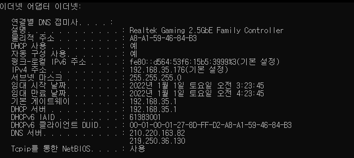

# TCP/IP

---

## IP 주소와 서브넷 마스크 그리고 기본 게이트웨이의 의미

- 이더넷 어뎁터

PC에서 사용하는 LAN 카드, LAN 카드를 NIC(Network Interface Controller)라고도 한다. 이더넷이란 LAN 영역에서 사용하는 통신 기술 중 사실상 표준이다.

- IP 주소

인터넷 공간에서 PC가 사용하는 고유한 식별자이다. IP 주소는 데이터를 송신하는 주체이기 때문에 출발지 주소이다.  127.0.0.1번은 자기의 LAN 카드 자신을 의미하는 루프백 주소이다.

- 서브넷 마스크

IP 주소와 쌍으로 사용하는 개념이다. 192.168.35.176 255.255.255.0 등과 같이 사용한다. IP 주소를 서브넷 마스크를 이용해 표기하는 방식을 서브넷 마스크 표기법이라고 부른다. 위 예에서 192.168.35은 255.255.255에 대응하고 176은 0에 대응한다. 이때 255.255.255번에 대응하는 192.168.0을 네트워크 ID라고 부르고, 13번을 호스트 ID라고 부른다.

- 기본 게이트웨이

게이트웨이를 다른 말로 라우터라고 한다. 게이트웨이는 무선 공유기를 의미하고, 무선 공유기에서 사용하는 IP 주소가 192.168.35.1이다. 라우터는 인터넷 공간에서 각기 다른 호스트 사이를 연결해주는 라우팅을 수행한다.

---

## DHCP 서비스와 DNS 서비스 그리고 물리적 주소의 의미

- DHCP 사용 : PC에서 IP 주소를 유동 IP 방식으로 사용
    - IP 주소는 원래 사용자가 IP 주소와 서브넷 마스크, 기본 게이트웨이 등을 직접 입력해야 하지만 쉽지 않다. DHCP 서비스는 사용할 IP 주소 범위를 서버에 미리 등록하면 PC 사용자에게 IP 주소와 서브넷 마스크, 게이트웨이 IP 주소, DNS 서버 IP 주소를 자동으로 할당해준다.
    - 가정에서 인터넷을 사용하는 초고속 인터넷 가입자는 DHCP 서비스 방식을 이용한다.

- ‘임대 시작 날짜’와 ‘임대 만료 날짜’가 있는데 DHCP 방식에 따라 IP 주소를 할당받은 시간과 IP 주소를 사용한 시간이고 동시에 PC 사용 시간을 의미한다.

- ‘기본 게이트웨이’와 ‘DHCP 서버’의 IP 주소가 같은데 게이트웨이에서 DHCP 기능을 수행한다는 것이다. 다시 말해, 무선 공유기는 게이트웨이 역할과 DHCP 서버 기능도 수행한다.

- DNS 서버 : 두 IP 주소가 보이는데 IPS에서 제공하는 DNS 서버 IP 주소다.
    - DNS 서버는 사용자가 입력한 도메인 네임을 IP 주소로 변환한다.
    - 도메인 네임과 IP 주소의 대응관계를 일종의 DB 형태로 저장해 사용하는 기능이 DNS 서비스

- 물리적 주소: 맥(MAC) 주소라고도 하며 이더넷 어댑터 로컬 영역 연결 부분과 관련이 있다.
    - 맥 주소는 LAN 영역에서 내부 통신을 수행하기 위해 필요한 주소이다.
    - 출발지에서 스위치 장비를 통해 목적지로 이동하고, 이 때 스위치 장비의 내장 테이블에 맥 주소를 저장 및 검색하는데 이 과정을 스위칭이라고 한다.
    - 스위치는 맥 주소 인식을 통해 목적지 맥 주소가 있는 해당 포트로만 데이터를 전송하는데, 이를 포워딩이라고 한다.