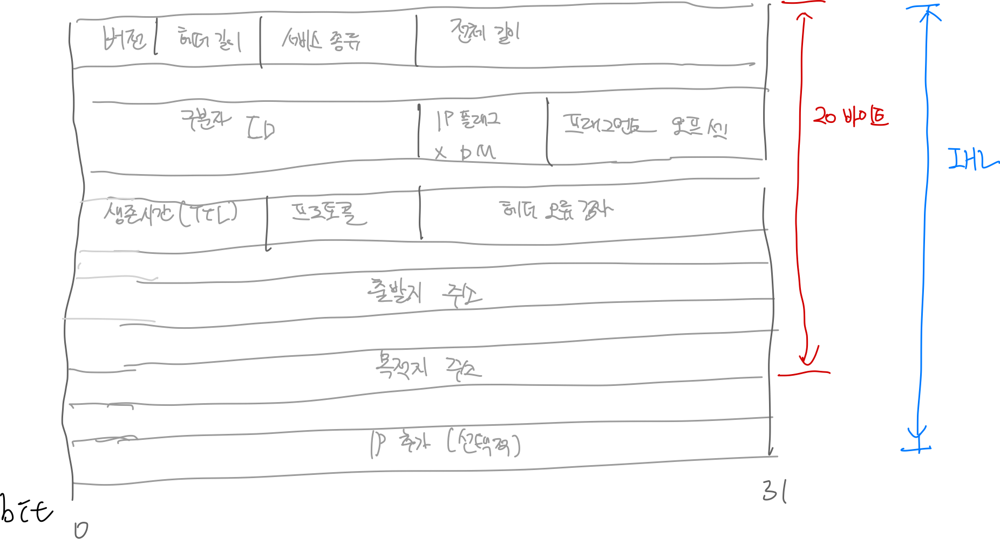

# TCP/IP

## TCP/IP 프로토콜

- 네트워크 프로토콜은 네트워크 통신과정을 규정하는 공통 규칙 시스템으로 데이터 전송 과정을 안내하는데, TCP/IP프로토콜은 네트워크 프로세스를 정의하고, 처리, 전송, 수신을 정의하는 프로토콜 스위트 
- TCP/IP 표준의 목적은 호환성을 보장하는것
- TCP/IP 전송을 실제 처리하는 작업은 TCP/IP 구현
- TCP/IP 표준은 통신 규칙을 정의하고, TCP/IP 구현은 네트워크에 참여핟록 기능을 수행

## TCP/IP의 기능

- 엔드 노드 검증 : 전달의 양끝의 엔드노드에서 통신을 수신하고 검증하는 책임이 있으며, 의사 소통을 관리하는 중앙 시스템은 없음
- 동적 라우팅 : 노드는 여러 경로를 통해 연결되는데, 라우터는 현재 상태를 기반으로 경로를 선택

- 논리 주소 지정
    - MAC은 어댑터의 물리 조소로, 제조 공장에서 할당. LAN에서 물리 주소를 사용해서 물리적 네트워크를 통해 전송하는데 네트워크 종류가 다양하다. 이때 네트워크 관리자가 라우터와 같이 네트워크 트래픽을 줄이기 위해 네트워크를 세분화 하고, 서브넷이라는 더 작은 네트워크로 세분화하는데 논리 주소 지정을 통해 서브넷 기능을 제공 이러한 논리 주소를 IP주소라고 한다
    - IP 주소는 네트워크 ID번호, 네트워크의 서브넷 ID 번호, 컴퓨터를 식별하는 호스트 ID번호

- 라우팅
    - 논리 주소를 읽고 네트워크를 통해 데이터를 전달
    - 대규모 네트워크에서 로컬 서브넷을 분리

- 이름확인
    - 도메인 이름을 IP 주소로 매핑하는 이름확인 이라고 하는데, 이름 서버에서 도메인 이름을 IP 주소로 변환하도록 하는 표를 저장
    - 이를 통해 사용자가 실제 IP 주소를 알아낼 필요가 없음

- 오류 제어 및 흐름 제어
    - 네트워크에서 안정적인 데이터 전송을 보장
    - 전송 계틍은 오류제어, 흐름제어, 승인 기능을 정의하며, 네트워크 접근 계층에 있는 낮은 수준 프로토콜도 오류 제어 시스템에 중요한 역할

- 애플리케이션 지원
    - 몇개의 애플리케이션은 동일한 컴퓨터에서 실행될 수 있는데, TCP/IP는 네트워크에서 애플리케이션으로 인터페이스로 포트를 통해 수행. 포트는 컴퓨터의 논리적 파이프 라인 

## TCP/IP 방식의 계층적 구조

1973년 당시 LAN 영역과 WAN 영역, 스위치 또는 라우터 등이 태동하던 시절이다. 단지 전송과 제어라는 통신의 기본 내용을 인터넷 공간에서 구현하기 위한 구조로 등장한 개념이 TCP/IP 프로토콜이다.

TCP/IP 프로토콜은 5계층을 거쳐 데이터를 전송한다. 송신자 OS는 응용 계층 → 전송 계층 → 네트워크 계층 → 데이터 링크 계층 → 물리 계층 순으로 통과하면서 데이터를 전송한다.

- 송신의 시작인 응용 계층에서 UDP 기반의 페이로드를 생선한 후 사용자의 정보를 저장한다. 응용 계층에서 생선한 전송 단위를 메시지라고 부른다.
- 메시지는 전송 계층으로 넘어가 첫 번째 헤더와 결합한다. 첫 번째 헤더에서 중요한 부분은 포트 번호이고, 이 형태를 데이터그램이라고 부른다.
- 네트워크 계층으로 넘어가 두 번째 헤더와 결합한다. 여기서 중요한 정보는 IP 주소이고, 이러한 전송 단위를 패킷이라고 부른다.
- 데이터 링크 계층으로 넘어가 세 번째 헤더와 결합하고, 여기서 중요한 정보는 MAC 주소이다. 이러한 단위를 프레임이라고 부른다.

| 계층 |  해당 계층에 속하는 프로토콜 |
| --- | --- |
| 응용 | FTP, SSH, TELNET, SMTP, DNS, DHCP, HTTP, POP3, SNMP, SSL 등 |
| 전송 | TCP, UDP |
| 네트워크 | IP, ICMP, IGMP, ARP, RARP |
| 데이터 링크 | 이더넷, PPP 등 |
| 물리 |  |

---

## TCP/IP 방식의 응용 계층

응용 계층에는 이론상 65,536개에 이르는 페이로드 생성 프로토콜이 있다. DNS 또는 HTTP 같은 프로토콜이 바로 TCP/IP 응용 계층에 속한다. 응용 계층에서는 사용자의 정보를 저장하는 페이로드 생성 기능을 수행한다. 이 때 운영체제는 응용 계층에 속하는 프로토콜을 포트 번호로 인식한다.

인터넷에 수많은 LAN 영역을 네트워크 ID로 구분하는 것처럼 응용 계층에 존재하는 수많은 프로토콜은 포트 번호로 구분한다.

포트 번호에는 해당 프로토콜에서 발생한 정보가 흐르는 가상의 통로라는 의미도 있다. SMTP가 사용하는 25번 포트는 전자 우편과 관련된 내용이 담겼고, DNS가 사용하는 53번에는 도메인 네임에대한 질의와 응답 내용이 담겼다.

| 구분 | 명칭 | 비고 |
| --- | --- | --- |
| 0~1,023 | 잘 알려진 포트 | 주로 서버에서 사용 |
| 1,024~49,151 | 등록 포트 번호 | 주로 클라이언트에서 사용 |
| 49,152~65,535 | 사설 또는 동적 포트 번호 | 주로 클라이언트에서 사용 |

포트 스캔이란 원격지 호스트를 대상으로 어떤 포트 번호를 사용하는지 확인하는 기법이다.

---

## TCP/IP 방식의 전송 계층

전송 계층에는 응용 계층과 달리 2개의 프로토콜만 있다. UDP와 TCP이다. UDP 방식과 TCP 방식의 차이점은 버퍼링 유무에 따라 구분한다.

UDP 방식은 응용 계층에서 페이로드를 생성하면 전송 계층에서 페이로드 앞에 포트 번호가 담긴 헤더를 붙인 뒤 네트워크 계층으로 전송 과정을 넘긴다. UDP 방시은 일반적으로 512바이트 미만의 페이로드를 대상으로 오직 전송 과정에만 초점을 두고 개발해서 실시간 요구 환경에 적합하다.

TCP는 전송 전 3당계 연결 설정을 수행해야 한다. 이를 수행하기 위해 TCP 페이로드를 응용 계층 버퍼에 임시로 저장하고 전송 계층에서 SYN 신호를 담은 세그먼트 1개를 생성한다. SYN 세그먼트는 네트워크 계층과 데이터 링크 계층을 차례로 통과하면서 각 헤더를 붙인 뒤 물리 계층에서 비트 단위로 변환해 목적지로 나간다.

| SYN 신호가 담긴 세그먼트 헤더 | IP 패킷 헤더 | 이더넷 프레임 헤더 |
| --- | --- | --- |

수신 측 호스트는 해당 SYN 신호를 전송 계층까지 올린 뒤, 전송 계층에서 SYN/ACK 신호를 담은 세그먼트 1개를 생성해 출발지로 보낸다.

| SYN/ACK 신호가 담긴 세그먼트 헤더 | IP 패킷 헤더 | 이더넷 프레임 헤더 |
| --- | --- | --- |

그러면 송신측 호스트에서도 SYN/ACK 신호를 전송 계층까지 올린 뒤 ACK 신호를 담은 세그먼트 1개를 생성해 목적지로 보낸다. 이것으로 전송전 3단계를 완성한다.

| ACK 신호가 담긴 세그먼트 헤더 | IP 패킷 헤더 | 이던셋 프레임 헤더 |
| --- | --- | --- |

3단계 연결을 확립하면 OS는 응용 계층 버퍼에 저장한 TCP 페이로드를 전송 계층으로 넘긴다. 전송 계층은 TCP 페이로드를 단편화 한다. 단편화가 끝나면 조각난 페이로드 앞에 출발지 포트 번호와 목적지 포트 번호 등이 담긴 헤더가 붙는 세그먼트를 생성한다.

경우에 따라서 전송은 응용 계층에서 시작하는 겨우도 있고 전송 계층에서 시작하는 경우도 있고 네트워크 계층에서 시작하는 경우도 있다. 응용 계층에서 시작한 전송은 상대방 응용 계층에서 끝나고 전송 계층에서 시작한 전송은 상대방 전송 계층에서 끝난다.

UDP 헤더의 크기는 8바이트로 고정이다. 출발지 포트와 목적지 포트 항목은 16비트 크기를 이룬다. 길이 항목에는 UDP 페이로드와 UDP 헤더를 더한 데이터그램 크기 정보가 담긴다. 오류 검사 항목은 기본적으로 비활성 상태다.

TCP 방식은 UDP 방식과 달리 버퍼링과 단순화 기능을 수행하기 때문에 헤더 구조가 상대적으로 복잡하다. TCP 헤더는 일반적으로 20 바이트지만 추가 항목을 이용해 21바이트 이상으로 사용할 수도 있다.

일련번호와 확인 번호 항목은 3단계 연결 설정 등과 관련이 있다. OS는 전송 전 3단계 연결 설정이나 전송 후 3단계 연결 종료 등을 수행할 때 송신자와 수신자 사이에 주고받은 세그먼트의 연속성을 보장하기 위해 일련번호와 확인 번호를 이용한다.

| 구분 | 일련번호 | 확인 번호 | 비고 |
| --- | --- | --- | --- |
| SYN | 0 | 0 | 송신자 |
| SYN/ACK | 0 | 1 | 수신자 |
| ACK | 1 | 1 | 송신자 |

오프셋 항목에는 TCP 헤더의 길이를 담는다.

플래그 항목에는 TCP 3단계 연결 설정이나 전송 후 TCP 3단계 연결 종료 등에 사용하는 SYN, FIN 신호 정보 등을 저장한다.

| 구분 | 의미 |
| --- | --- |
| SYN | 상대방과 동기화 확립 |
| FIN | 상대방과 동기화 해제 |
| ACK | 확인 응답 |
| RST | 상대방과 연결을 강제로 종료 |
| PSH | TCP 페이로드를 포함하는 신호 |
| URG | 긴급 데이터라는 신호 |
| ECN | 혼잡 발생 신호 |
| CWR | 혼잡 윈도 크기 감소 신호 |

윈도 항목은 흐름 제어 기능과 관련이 있다. 플래그 항목과 윈도 항목은 밀접한 관계가 있다. 송신자는 수신자의 확인 응답에 따라 전송할 정보의 양을 조절하는데, 이를 혼잡 윈도라고 한다. 송신자가 전송할 수 있는 동적인 정보의 양을 슬라이딩 윈도라고 한다.

1. 송신자가 1번부터 20번의 데이터를 전송하면 오류를 대비하기 위해 자신의 버퍼에 저장한다.
2. 수신자가 데이터를 정상적으로 수신하면, 수신자는 윈도 항목에 21 숫자를 담아 ACK 플래그로 응답한다. 다음에는 21번부터 데이터를 보내라는 신호다. 그럼 송신자는 1번 부터 20번까지 데이터를 삭제한 뒤 21번부터 60번까지 데이터를 전송하고, 해당 데이터를 다시 버퍼에 저장한다.
3. 만약 혼잡과 부하 등으로 수신자가 21번부터 40번까지만 수신했다면, 윈도 항목에 41번을 담아 ACK/CWR 플래그로 응답한다. 그러면 송신자는 41번부터 60번까지 해당하는 데이터를 재전송한다.

--- 

## TCP/IP 방식의 네트워크 계층

네트워크 계층에서는 각 세그먼트 앞에 IP 주소를 주요 정보로 하는 헤더를 추가하면서 패킷을 생성한다.

- IP 헤더에서 제일 먼저 버전 항목을 확인할 수 있다. IPv4 주소라면 4가 들어가고, IPv6 주소라면 6이 들어간다.
- 헤더 길이 항목에는 IP 헤더의 크기가 들어간다.
- 서비스 종류 항목에는 해당 패킷의 전송 우선순위를 저장한다. ToS 기능을 지정하면 우선순위를 설정해 회선이 혼잡할 경우에도 해당 패킷을 우선적으로 전송한다.
- 전체 길이 항목에는 IP 헤더를 포함한 패킷 전체의 길이 정보가 담긴다.
- ID, IP 플래그, 프래그먼트 오프셋 항목은 MTU에 따른 패킷 분할 정보를 담는 항목이다. MTU는 최대 전송 단위, 각 프로토콜에서 정한 데이터 크기의 최대 범위를 뜻한다.
- 생존 시간 항목은 라우팅 루프가 일어난 구간에서 패킷을 폐기하기 위한 용도로 사용한다. 해당 패킷이 통과할 수 있는 라우터의 개수 정보를 담는 항목이다.
- 프로토콜 항목은 상위 계층에 속한 프로토콜 번호를 저장한다. UDP 페이로드면 17, TCP 페이로드면 6으로 설정한다.
- 헤더 오류 검사는 UDP/TCP 헤더와 마찬가지로 비활성 상태다.

### 패킷 분할

이더넷 방식에서 MTU는 1,500 바이트다. 만약 5,900 바이트 크기의 데이터가 발생하면 ID 항목, 플래그 항목 프래그먼트 오프셋 항목을 이용해 해결한다. 플래그 항목에서 사용하는 비트 D는 ‘Do not fragment’의 뜻이고, M은 ‘More fragments’를 의미한다. 5,900바이트 크기의 패킷은 100바이트 크기의 쓰레기 값을 채운다. 이를 패딩이라고 한다. 그 다음 OS는 쓰레기 값을 포함한 6,000바이트 크기의 패킷을 각각 1,500바이트로 분할한다. 그 후 이더넷 구간을 통과시킨다.

| ID 항목 | 플래그 항목(D 비트) | 플래그 항목(M 비트) | 프래그먼트 오프셋 |
| --- | --- | --- | --- |
| 1234 | 0 | 1 | 0 |
| 1234 | 0 | 1 | 1,500 |
| 1234 | 0 | 1 | 3,000 |
| 1234 | 0 | 0 | 4,500 |

## IP 주소

사설 IP 주소는 LAN 전용 주소다.  사설 IP 주소는 LAN 영역에서 전용으로 사용하는 주소임에도 실제 인터넷에 접속할 수 있는데, NAT 기법을 사용하기 때문에 가능하다. NAT란 출발 사설 IP를 공인 IP 주소로 바꾸는 기법이다. 보통 라우터(무선 공유기) 같은 장비에서 이용한다. NAT 기법에 포트 번호 주소를 연동해 사용할 경우 PAT라고 한다. PAT를 이용하면 1개의 공인 IP 주소에 65,536개의 사설 IP 주소를 연결할 수 있다.

사설 IP 주소는 외부에서 접근할 수 없다. 사설 IP 주소를 사용하여 웹 서버를 구축했다면 포트 포워딩이란 PAT 기법을 응용해 외부에서 내부로 접근할수 있도록 한다.

### ICMP (Internet Control Message Protocol )

ICMP는 IP 등장 이후 전송 작업을 화면에 출력하기 위한 용도로 등장했다. ping 명령어 결과를 화면으로 볼 수 있는 이유도 ICMP가 동작하기 때문이다. ICMP 방식의 오류 통보란 전송 중 일어날 수 있는 목적지 도달 불가나 발신지 억제 또는 시간 초과나 매개변수의 문제 등을 사용자 화면에 출력하기 위한 기능이다.

목적지 호스트로 ICMP 질의를 요청하면 쓰레기 값으로 채워진 페이로드를 생성한다. ICMP 프로토콜은 네트워크 계층에서부터 페이로드를 생성한다. 그 다음 8바이트 크기의 ICMP 헤더가 붙는다. ICMP 헤더에는 ICMP가 요청인지, 응답인지를 구분하는 정보가 담긴다.

---

## TCP/IP 방식의 데이터 링크 계층

데이터 링크 계층은 네트워크 계층에서 넘어온 패킷을 기반으로 프레임 전송 단위를 형성한다. 원래 TCP/IP 방식은 응용 계층과 전송 계층, 네트워크 계층으로 이루어진 구조였다. 이후 LAN/WAN 기술이 발전하면서 새롭게 구성한 계층이 데이터 링크 계층이다.

스위칭 통신을 구현하는 LAN 영역에서 사용하는 프로토콜에는 이더넷 방식, 토큰링, FDDI(Fiber Distributed Data Interface) 그리고 LAN/WAN 영역을 통합한 ATM(Asynchronous Transfer Mode) 방식 등이 있다. 오늘늘은 이더넷 방식이 LAN 영역에 사실상 표준으로 자리 잡았다.

라우팅 통신을 구현하는 WAN 영역에서는 HDLC(High-Level Data Link Control), PPP(Point-to-Point Protocol), 그리고 가상 회선에 기반해 구현한 X.25, 프레임 릴렝, ATM 방식 등이 있다. LAN 영역과 달리 WAN 에는 사실상 표준이 없어 상대방 라우터와 연동 시 프로토콜 설정에 주의해야 한다.

| 헤더 구분 | 생성 계층 | 주요 정보 | 헤더 크기 | 비고 |
| --- | --- | --- | --- | --- |
| UDP | 전송 | 포트 번호 | 8 바이트 |  |
| TCP | 전송 | 포트 번호 | 20 바이트 |  |
| IP | 네트워크 | IP 주소 | 20 바이트 |  |
| ICMP | 네트워크 |  | 8 바이트 |  |
| ARP | 네트워크 | IP/맥 주소 | 28 바이트 | 페이로드 없음 |

ARP 헤더에는 IP 주소와 맥 주소가 있다. 데이터 링크 계층을 생성하면서 LAN 영역에서 사용하는 맥 주소와 네트워크 계층에서 사용하는 IP 주소의 연결을 위해 설계했다. ARP 프로토콜에는 페이로드 영역이 없이 오직 헤더로만 이루어진 구조이다. ARP 헤더 구조는 다음과 같다.

---

## TCP/IP 방식의 물리 계층

물리 계층에서는 기계적, 전기적, 절차적 기능 등을 정의한다. 물리 계층에 해당하는 장치는 UTP 회선과 처리에 적합한 비트 신호를 전송에 적합한 비트로 변환해주는 DCE 장치, 허브가 있다. 무선 공유기도 허브 장비의 기능을 수행한다.

| 구분 | 관련 계층 | 처리 단위 | 테이블 유무 | 동작 방식 |
| --- | --- | --- | --- | --- |
| 허브 | 물리 | 비트 |  | 플러딩 |
| 스위치 | 데이터 링크 | 프레임 | 스위칭 테이블 | 포워딩, 플러딩 |
| 라우터 | 네트워크 | 패킷 | 라우팅 테이블 | 포워딩 |

PC 에서 발생한 비트가 회선을 타고 허브에 도착한다. 허브는 물리 계층에서 비트 단위를 처리하는 장치여서 비트 단위로 들어온 신호를 1번 포트에서 수신한 뒤 1번 포트를 제외한 모든 포트로 비트 단위를 플러딩한다. 허브는 전송을 위한 주소 테이블이 없어서 비트를 수신한 포트를 제외하고 나머지 포트로만 플러딩해 스위치로 흘러간다.

스위치는 데이터 링크 계층에서 프레임 단위를 처리한다. 비트 단위로 들어온 신호를 수신한 뒤 프레임으로 디캡슐레이션한다. 스위치 OS는 프레임 헤더에 담긴 목적지 맥 주소가 자신의 스위칭 테이블에 있는지 여부를 검색한다. 검색 후 프레임을 다시 비트로 변환한 뒤 특정 포트로만 비트 신호를 포워딩한다. 이 때 목적지 맥 주소를 제외한 나머지 포트로 비트 신호가 넘치지 못하도록 블로킹 처리한다.

스위치의 포워딩 동작에 따라 비트 신호는 라우터의 이더넷 인터페이스로 흘러간다. 라우터는 네트워크 계층에서 패킷 단위를 처리하는 장치여서 비트 단위로 들어온 신호를 포트에서 수신한 뒤 프레임으로 변환해 자신의 이더넷 인터페이스에 새겨진 맥 주소와 프레임 헤더의 목적지 맥 주소를 비교한다. 일치할 경우 프레임을 패킷으로 변환한다. 라우터 OS는 패킷 헤더에 담긴 목적지 IP 주소가 자신의 라우팅 테이블에 있는지 여부를 검색한다. 목적지 IP 주소를 검색했다면 해당 인터페이스로 포워딩하기 위해 패킷을 프레임으로 변환한 뒤 프레임 헤더에는 맥 주소가 아닌 PPP 정보를 삽입한다.

PPP 정보를 담은 프레임은 비트로 최종 변환한 뒤 해당 경유지 인터페이스를 타고 목적지 라우터로 흘러간다.

---

