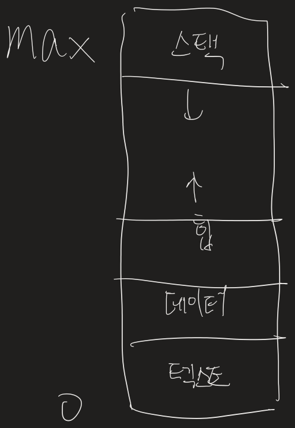
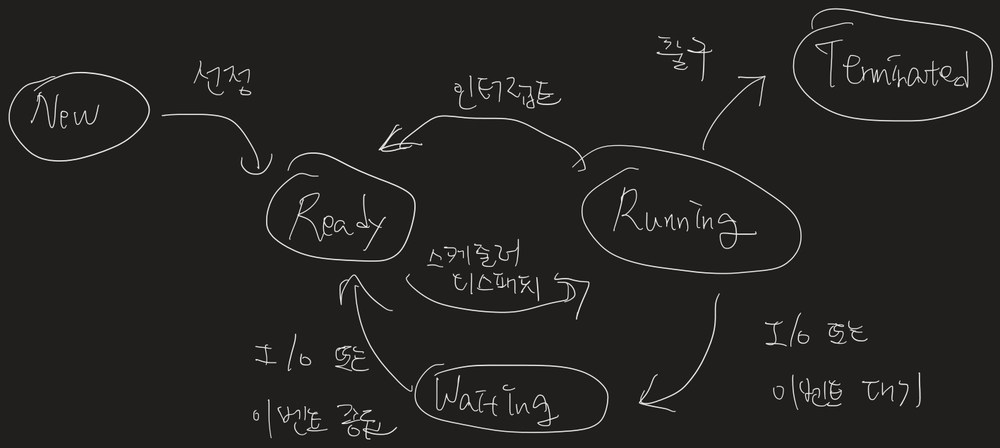

# 운영체제

---

## 운영체제란

### 운영체제의 역할
각각의 응용 프로그램이 활동할 수 있는 환경과, 필요로 하는 컴퓨터 자원을 나누어주며, 응용프로그램으로부터 컴퓨터 자원을 보호하는 역할
1) 자원 관리 (효율성)
2) 자원 보호 (안정성)
3) 하드웨어 인터페이스 제공 (확장성)
4) 사용자 인터페이스 제공 (편리성)

### 운영체제의 구조

#### 커널과 인터페이스

- 커널 : 프로세스 관리, 메모리 관리, 저장장치 관리와 같은 운영체제의 핵심적인 기능
- 인터페이스 : 커널에 사용자의 명령을 전달하고 실행결과를 알려주는 역할

##### 커널이 하는 일
1) 프로세스 관리
2) 메모리 관리
3) 파일 시스템 관리
4) 입출력 관리
5) 프로세스 간 통신 관리

#### 시스템 호출
커널이 자신을 보호하기 위해 만든 인터페이스로 자원을 이용하려면 시스템 호출이라는 인터페이스를 이용하여 접근해야한다
 
커널이 제공하는 시스템 관련 서비스를 모아놓음
ex) printf()를 사용하면 화면의 문자와 겹치는 부분 없이 문자를 화면에 출력
 
사용자가 자발적으로 커널 영역에 진입할 수 있는 유일한 수단.

#### 드라이버
커널과 하드웨어의 인터페이스.  
커널은 입출력의 기본적인 부분만 제작, 하드웨어의 특성을 반영한 소프트웨어(디바이스 드라이버)를 하드웨어 제작자에게 받아 커널이 실행될 때 함께 실행되도록 한다.  
마우스, 키보드 같은 복잡하지 않은 디바이스 드라이버는 커널에 포함되어 있지만, 복잡한 드라이버는 사용자가 직접 설치해야 한다.  

---

## 컴퓨터 시스템의 구성
### 컴퓨터 시스템 연산

현대 컴퓨터 시스템은 하나 이상의 CPU와 다수의 장치 제어들로 구성되고, 공용 버스로 연결되며 이를 이용해 공유 메모리에 접근한다. CPU와 장치 제어기는 메모리 사이클을 얻기 위해 경쟁하며 병렬 실행될 수 있다. 공유 메모리에 질서 있는 접근을보장하기 위해 메모리 제어기가 접근을 동기화 시킨다.

시스템은 부트된 상태에서 사건(event)이 발생을 기다리며 인터럽트(interrupt)에 의해 전달 받는다. 하드웨어는 언제든지 시스템 버스를 통해 CPU에 신호를 보내 인터럽트를 발생 시킬수 있다. CPU가 인터럽트시 하던 일을 중지하고, 인터럽트를 처리하기로 한 서비스 루틴의 시작 주소로 이동해 실행한다. 그 후 다시 인터럽트 된 연산을 재개한다.

### 저장장치 구조

CPU는 명령어를 오직 메모리에서 가져올 수 있으므로 실행하려는 프로그램은 메모리에 있어야 한다. 메모리는 바이트 배열을 제공한다. 각 바이트는 자신의 주소를 가지고 있고, 특정 메모리 주소에 대한 적재(load), 저장(store) 명령을 통하여 전송이 이루어진다. 적재는 메모리부터 CPU의 레지스터로 한 바이트 또는 한 워드를 옮기는 것이다. 저장은 레지스터의 내용을 메모리로 옮긴다.

폰노이만 구조 시스템에서 명령-실행 사이클은 메모리로부터 명령을 인출해 명령 레지스터에 저장한다. 이어서 명령을 해독하고 메모리로부터 피연산자를 인출하여 내부 레지스터에 저장한다. 명령을 실행한 후에 결과를 다시 메모리에 저장할 수 있다. 메모리 장치는 연속적으로 전달되는 메모리 주소에만 관심이 있다. 메모리는 이들 주소가 명령 카운터, 색인, 간접 주소, 리터럴 주소로 부터 유래되어있는지 알지 못한다.

### 입출력 구조

범용 컴퓨터 시스템은 여러 장치 제어기와 CPU들로 구성되며 공통 버스로 연결된다. 장치 제어기에 따라 하나 이상의 장치가 부착될 수 있다. SCSI(Small Computer Systems Interface) 제어기에는 7개 이상의 장치를 붙일 수 있다. 장치 제어기는 로컬 버퍼 저장장치와 특수 목적용 레지스터 집합을 관리하고 이들 사이의 데이터 전송을 담당한다.  통상적으로 OS는 각 장치 제어기마다 디바이스 드라이버를 가지고 있고, 이는 장치 제어기의 동작을 이해하고 OS의 다른 부분들에게 장치에 대한 일관된 인터페이스를 제공한다.

입출력 연산을 하기 위해 디바이스 드라이버는 장치 제어기의 적절한 레지스터에 필요한 값을 적재한다. 제어기는 자신의 로컬 버퍼로 데이터 전송을 하고 인터럽트를 이용해 완료 후 디바이스 드라이버에 통보한다. 디바이스 드라이버는 제어를 OS에게 반환한다.

인터럽트 구동 방식은 디스크 입출력 같은 대량의 데이터를 전송할 때 높은 오버헤드를 초래한다. 이 문제를 해결하기 위해 직접 메모리 접근(DMA) 장치가 사용된다. 장치 제어기는 CPU의 개입 없이 메모리로부터 자신의 버퍼 장치로부터 메모리로 데이터 블록 전체를 전송한다.

--- 

## 컴퓨터 시스템 구조

### 다중 처리기 시스템 (Multiprocessor Systems)

매우 밀접한 통신을 하는 둘 이상의 처리기들을 가지며 컴퓨터 버스, 클록, 메모리와 주변 장치를 공유한다. 현재 사용하는 다중 처리기 시스템은 두 가지 형태를 가진다.

1. 비대칭적 다중 처리

   각 처리기에 특정 태스크가 할당된다. 하나의 주 처리기가 시스템을 제어한다.  다른 처리기들은 주 처리기의 명령을 실행하거나 미리 지정된 태스크를 실행한다. 주 처리기는 작업을 스케줄하고 종속 처리기에 작업을 할당한다.

2. 대칭적 다중 처리

   가장 일반적인 시스템으로 각 처리기가  OS 기능과 프로세스를 포함한 모든 작업을 처리한다.

   

--- 

## 운영체제의 구조

운영체제의 가장 중요한 하나는 다중 프로그램(multiprogramming)이 가능하다는 것이다. 다중프로그래밍은 한 명의 사용자도 여러 프로그램을 동시에 실행시킨다. 운영체제는 한 번에 여러 작업을 메모리에 적재한다. 작업들은 디스크의 작업 풀(pool) 내에 유지되 메모리의 할당을 기다린다. 메모리에 존재하는 작업의 집합은 작업 풀에 대기 중인 작업의 부분집합이다.

시분할은 다중 프로그래밍의 논리적 확장이다. 시분할 시스템에서 각 동작이나 명령은 대체로 짧은 경향이어서 각 사용자를 위해서 짧은 CPU 시간만 할당한다. 이를 위해 CPU 스케줄링과 다중 프로그래밍을 사용한다.

시분할 시스템에서 OS는 적절한 응답 시간을 보장해야 하고, 이는 종종 스와핑에 의해 달성된다. 스와핑은 프로세스를 메모리에서 디스크로 적절하게 스왑인(swap-in) 또는 스왑아웃(swap-out) 시킨다. 더 일반적인 방법으로는 가상 메모리가 있다. 이는 작업의 일부만 메모리에 적재되도 수행을 허용하는 기법이다.

---

## 운영체제 연산

운영체제는 사건이 일어나기를 기달린다. 사건은 인터럽트나 트랩을 발생시켜 신호를 보낸다. 트랩(예외)은 소프트웨어에의해 발생한 인터럽트로 오류 혹은 사용자 프로그램의 OS 서비스 요청 등에 의해 발생한다. 올바르게 설계된 OS는 잘못된 프로그램의 수행을 부정확하게 만들 수 없도록 보장해야 한다.

### 이중연산모드

사용자 모드와 커널 모드(슈퍼바이저모드, 시스템 모드, 특권 모드)를 필요로 한다. 시스템 부트 시 하드웨어는 커널 모드에서 시작한다. 이어 운영체제가 적재되고 사용자 모드에서 프로세스가 시작된다. 트랩이나 인터럽트가 발생할 때마다 사용자 모드에서 커널 모드로 전환한다.

하드웨어는 특권 명령이 커널 모드에서만 수행하도록 한다. 커널 모드로 전환, 입출력 제어, 타이머 관리, 인터럽트 관리를 위한 명령들이 이에 해당한다.

### 타이머

운영체제는 CPU에 대한 제어를 유지해야 한다. 사용자 프로세스가 무한 루프에 빠지거나 시스템 서비스 호출에 실패하여 제어가 OS로 복귀하지 않는 경우를 허용해서는 안된다. 이를 위해 타이머를 사용한다. 타이머는 지정된 시간 후에 인터럽트 하도록 설정할 수 있다.

---

## CPU 스케줄링

CPU 스케줄러는 프로세스가 생성된 후 종료될 때 까지 모든 상태 변화를 조정하는 일을 한다.

### 스케줄링의 목적

- 공평성 : 모든 프로세스가 자원을 공평하게 배정받아야 한다.
- 효율성 : 시스템 자원이 유휴 시간 없이 사용되도록 스케줄링을 한다.
- 안정성 : 우선순위를 사용하여 중요 프로세스가 먼저 작동하도록 배정한다.
- 확장성 : 프로세스가 증가해도 시스템이 안정적으로 작동하도록 조치해야 한다.
- 반응 시간 보장 : 시스템은 적절한 시간 안에 프로세스의 요구에 반응해야 한다.
- 무한 연기 방지 : 특정 프로세스의 작업이 무한히 연기되어서는 안 된다.

 

시스템의 안정성과 효율성을 높이기 위해 다른 프로세스보다 먼저 처리해야 하는 프로세스가 있으므로 CPU 스케줄러는 일정 부분 공평성을 희생한다.  
보통 운영체제 프로세스가 일반 프로세스보다 우선적으로 CPU를 배정 받는다.
 

### 선점형 스케줄링과 비선점형 스케줄링

- 선점형 스케줄링 : 어떤 프로세스가 CPU를 할당받아 실행 중이더라도 운영체제가 CPU를 강제로 빼앗을 수 있는 스케줄링 방식 ex) 인터럽트
- 비선점형 스케줄링 : 어떤 프로세스가 CPU를 점유하면 다른 프로세스가 이를 빼앗을 수 없는 스케줄링 방식

### 다중 큐

#### 준비상태의 다중 큐

가장 높은 우선순위 프로세스에 CPU를 할당하기 위해 CPU스케줄러가 모든 프로세스 제어 블록을 검색하는것은 번거롭다. 그래서 우선순위에 따라 여러 개의 큐를 만들면 편리하다.

 
준비 큐를 몇개로 나눌지, 여러개의 준비 큐에 있는 프로세스 중 어떤 프로세스에 CPU를 할당할지는 스케줄링 알고리즘에 따라 달라진다.

#### 대기상태의 다중 큐

대기 상태에서도 다중 큐를 사용하는데, 대기 상태는 입출력이 완료되기를 기다리는 프로세스가 모여 있는 곳이라, 시스템 효울을 위해 대기 상태에서 같은 입출력을 요구한 프로세스끼리 모아놓는다.

### 스케줄링 알고리즘

- 비선점형 알고리즘 : FCFS 스케줄링, SJF 스케줄링, HRN 스케줄링
- 선점형 알고리즘 : 라운드 로빈 스케줄링, SRT 스케줄링, 다단계 큐 스케줄링, 다단계 피드백 큐 스케줄링
- 둘다 가능한 알고리즘 : 우선순위 스케줄링

---

## 프로세스

프로세스란 실행 중인 프로그램을 말한다. 프로세스는 현대 시분할 시스템에서 작업의 단위이다.

프로세스는 작업을 처리하는데 특정 자원이 필요하다. CPU time, memory, files, I/O devices 등이 있다. 프로세스는 프로그램 카운터의 값과 레지스터의 내용으로 대표되는 현재 활동을 포함한다. 또한 함수의 매개변수, 복귀 주소와 로컬 변수와 같은 임시적인 자료를 가지는 프로세스 스택과 전역 변수들을 수록하는 데이터 섹션을 포함한다. 또한 프로세스 실행 중에 동적으로 할당되는 메모리인 힙을 포함한다.

메모리 상에 존재하는 프로세스의 구조는 다음과 같다.

### 프로세스 상태

프로세스는 실행되면서 상태가 변한다. 프로세스 상태는 부분적으로 프로세스의 현재 활동에 따라서 정의된다.

- New: 새로운 프로세스가 생성 중
- Running: 명령어들이 실행되고 있음
- Waiting: 프로세스가 이벤트 발생을 기다린다. (입출력 또는 신호의 수신)
- Ready: 프로세스가 처리기에 할당되기를 기다림
- Terminated: 프로세스의 실행이 종료됨

### 프로세스 제어 블록 (PCB, Process Control Block)

각 프로세스는 운영체제에서 프로세스 제어 블록에 의해 표현된다. 프로세스 제어 블록은 특정 프로세스와 연관된 여러 정보를 수록하며, 다음과 같은 것들을 포함한다.

- 프로세스 상태: New, Running, Waiting, Ready, Terminate
- 프로그램 카운터: 프로그램 카운터는 다음에 실행할 명령어의 주소를 가리킨다.
- CPU 레지스터들: 누산기(accumulator), 인덱스 레지스터, 스택 레지스터, 범용 레스터, 상태 코드 정보가 포함된다.
- CPU-스케줄링 정보: 프로세스 우선순위, 스케줄링 큐에 대한 포인터와 다른 스케줄링 매개변수들을 포함한다.
- 메모리 관리 정보
- 회계 정보: CPU 사용 시간과 경과된 실시간, 시간제한, 계정 번호, 잡 똔느 프로세스 번호 등을 포함한다.
- 입출력 상태 정보: 프로세스에게 할당된 입출력 장치들과 열린 파일의 목록등을 포함한다.