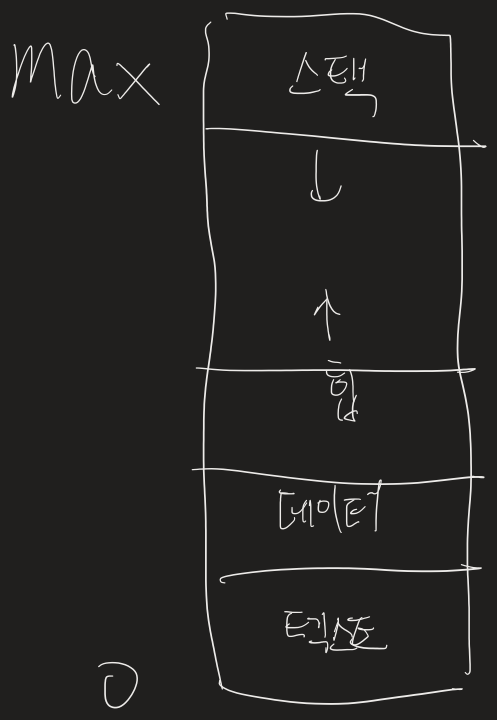
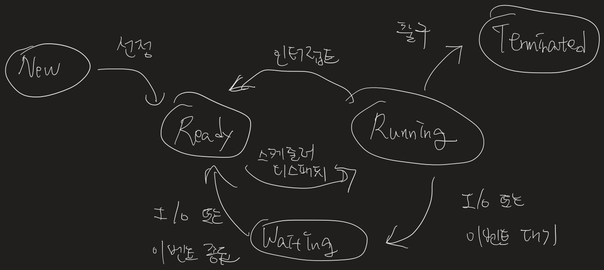
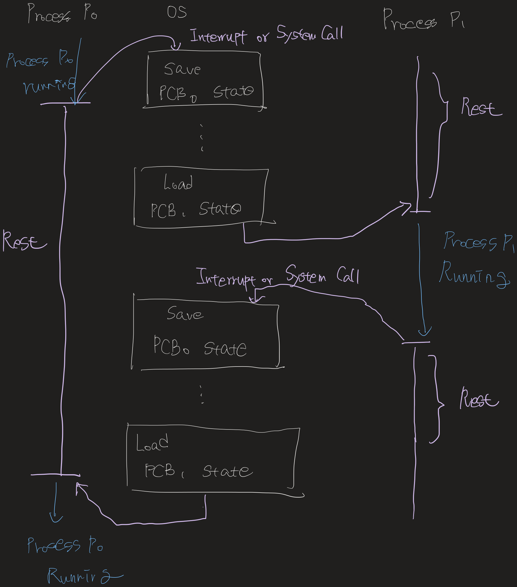

## 프로세스

프로세스란 실행 중인 프로그램을 말한다. 프로세스는 현대 시분할 시스템에서 작업의 단위이다.

프로세스는 작업을 처리하는데 특정 자원이 필요하다. CPU time, memory, files, I/O devices 등이 있다. 프로세스는 프로그램 카운터의 값과 레지스터의 내용으로 대표되는 현재 활동을 포함한다. 또한 함수의 매개변수, 복귀 주소와 로컬 변수와 같은 임시적인 자료를 가지는 프로세스 스택과 전역 변수들을 수록하는 데이터 섹션을 포함한다. 또한 프로세스 실행 중에 동적으로 할당되는 메모리인 힙을 포함한다.

메모리 상에 존재하는 프로세스의 구조는 다음과 같다.

### 프로세스 상태

프로세스는 실행되면서 상태가 변한다. 프로세스 상태는 부분적으로 프로세스의 현재 활동에 따라서 정의된다.

- New: 새로운 프로세스가 생성 중
- Running: 명령어들이 실행되고 있음
- Waiting: 프로세스가 이벤트 발생을 기다린다. (입출력 또는 신호의 수신)
- Ready: 프로세스가 처리기에 할당되기를 기다림
- Terminated: 프로세스의 실행이 종료됨

### 프로세스 제어 블록 (PCB, Process Control Block)

각 프로세스는 운영체제에서 프로세스 제어 블록에 의해 표현된다. 프로세스 제어 블록은 특정 프로세스와 연관된 여러 정보를 수록하며, 다음과 같은 것들을 포함한다.

- 프로세스 상태: New, Running, Waiting, Ready, Terminate
- 프로그램 카운터: 프로그램 카운터는 다음에 실행할 명령어의 주소를 가리킨다.
- CPU 레지스터들: 누산기(accumulator), 인덱스 레지스터, 스택 레지스터, 범용 레스터, 상태 코드 정보가 포함된다.
- CPU-스케줄링 정보: 프로세스 우선순위, 스케줄링 큐에 대한 포인터와 다른 스케줄링 매개변수들을 포함한다.
- 메모리 관리 정보
- 회계 정보: CPU 사용 시간과 경과된 실시간, 시간제한, 계정 번호, 잡 똔느 프로세스 번호 등을 포함한다.
- 입출력 상태 정보: 프로세스에게 할당된 입출력 장치들과 열린 파일의 목록등을 포함한다.

---

## 프로세스 스케줄링

다중 프로그래밍의 목적은 CPU 이용을 최대화하기 위해 항상 프로세스가 실행되도록 하는 데 있다. 시분할의 목적은 각 프로그램이 실행되는 동안 사용자가 상호 작용할 수 있도록 프로세스들 사이에서 CPU를 빈번하게 교체하는 것이다. 프로세스 스케줄러는 CPU에서 실행 가능한 여러 프로세스들 중에서 하나의 프로세스를 선택한다.

### 스케줄링 큐

프로세스가 시스템에 들어오면, 잡 큐에 놓여진다. 메인 메모리에 존재하며, 준비 완료 상태에서 실행을 대기하는 프로세스는 준비 완료 큐(ready queue)에 유지된다. 준비 완료 큐의 헤더는 리스트의 첫 번째와 마지막 PCB를 가리키는 포인터를 포함한다.

새로운 프로세스는 처음에 준비 완료 큐에 놓인다. 프로세스가 CPU를 할당받을 때까지 준비 완료 큐에서 대기한다. 프로세스에 CPU가 할당되어 실행되면, 여러 사건들 중의 하나가 발생할 수 있다.

- 프로세스가 입출력 요청을 하여 입출력 큐에 넣어질 수 있다.
- 프로세스가 새로운 자식 프로세스를 생성하고 자식 프로세스의 종료를 기다릴 수 있다.
- 프로세스가 인터럽트의 결과에 의해 강제로 CPU로부터 제거되고, 준비 완료 큐에 다시 놓일 수 있다.

처음 두 경우에서, 프로세스는 대기 상태 → 준비 완료 상태 → 준비 완료 큐에 넣어지고, 종료할 때까지 잊이 주기를 계속한다.

### 문맥 교환 (Context Switch)

문맥(Context)은 프로세스의 PCB 정보로 표현된다. 인터럽트가 발생할 때 시스템은 현재 문맥을 저장하한다. CPU를 다른 프로세스로 교환하려면 이전의 프로세스 상태를 보관하고 새로운 프로세스의 보관된 상태를 복구하는 작업이 필요하다.

---

## 프로세스 간 통신(IPC)

프로세스가 다른 프로세스들과 자료를 공유하는 프로세스는 상호 협력적인 프로세스다. 프로세스 협력을 허용하는 이유는 몇 가지 있다. 협력적 프로세스들은 데이터와 정보를 교환할 수 있는 프로세스 간 통신 기법이 필요하다. 기본적으로 공유 메모리와 메시지 전달의 두 가지 모델이 있다.

많은 처리 코어 시스템에서는 메시지 전달이 공유 메모리보다 더 나은 성능을 보인다. 공유 메모리는 공유 데이터가 여러 캐시 사이에 이주하기 때문에 발생하는 캐시 일관성 문제로 인하여 성능 저하가 발생한다.

### 공유 메모리 시스템

공유 메모리 영역은 통신하는 프로세스들이 공유 메모리 영역을 구축해야 한다. 프로세스들은 공유 영역에 데이터를 읽고 씀으로써 정보를 교환할 수 있다. 데이터의 형식과 위치는 프로세스들에 의해 결정되며 OS의 역할이 아니다.

협력하는 프로세스의 일반적인 패러다임은 생산자-소비자 문제가 있다. 생산자 프로세스는 정보를 생산하고 소비자 프로세스는 정보를 소비한다. 예를 들어, 웹 서버는 HTML 파일을 만들고 웹 브라우저는 이를 소비한다. 이 문제의 한 해결책은 공유 메모리를 이용하는 것이다. 생산자와 소비자 프로세스가 병행으로 실행되려면, 생산자가 정보를 채우고 소비자가 소모할 수 있는 버퍼가 사용 가능해야 한다. 이 버퍼는 생산자와 소비자가 공유하는 메모리 영역에 존재한다. 생산자가 한 항목을 생산하고, 그 동안에 소비자는 다른 항목을 소비한다.

### 메시지 전달 시스템

운영체제가메시지 전달 설비를 통하여 협력하는 프로세스 간의 통신 수단을 제공하는 방법이다. 메시지 전달 방식은 동일한 주소 공간을 공유하지 않아도 프로세스들이 통신을 하고, 동작을 동기화하는 기법을 제공한다. 메시지 전달 시스템은 send, receive의 최소한의 연산을 제공한다. 통신 연결을 구현하는 방법들은 다음과 같다.

- 직접, 간접 통신
- 동기식, 비동기식 통신
- 자동, 명시적 버퍼링